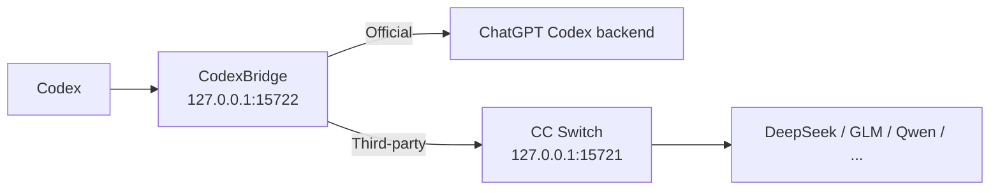

> **This project is under maintenance. Please wait patiently.**

<div align="center">

# CodexBridge

**Switch providers, not conversations.**  
Move between **OpenAI Official**, **DeepSeek**, **GLM**, and **Qwen** in Codex while keeping the same conversation usable whenever possible.

[Download](../../releases) · [简体中文](README.md) · [How it works](docs/ARCHITECTURE.md) · [Compatibility](docs/COMPATIBILITY.md)

[](../../actions/workflows/build-windows-release.yml)
[](../../actions/workflows/build-macos-release.yml)
[](../../releases)
[](LICENSE)
[](#compatibility)

</div>

CodexBridge is an **unofficial CC Switch companion**. It is not an official OpenAI or CC Switch component.

> **macOS users, read this first**: the Release is not Apple Developer signed or notarized (filenames include `-unsigned`), so macOS may block it on first launch. Approve it once, according to your system version:
>
> - **macOS 15 Sequoia and later**: open System Settings → Privacy & Security, click **Open Anyway** near the bottom, then run `Start CodexBridge.command` again.
> - **macOS 14 and earlier**: in Finder, right-click `CodexBridge.app` → Open → click **Open** again.
>
> Do not click "Move to Trash" and do not disable Gatekeeper. If it still fails, run `Start CodexBridge.command` again and click **Repair** in the dialog: it re-signs `CodexBridge.app` locally and clears that app's own quarantine flag, and never touches system security settings.

## What it fixes

If you use Codex with CC Switch, a conversation is still visible after you switch providers, but the next message often fails: tool and reasoning history is rejected by the new provider, and switching back to Official still carries stale third-party state.

CodexBridge is a compatibility layer between Codex and those providers. What it adds is session continuity between account-authenticated Official access and API-provider access. It is not a model aggregator and does not replace CC Switch: **CC Switch chooses which provider is used; CodexBridge keeps the same conversation usable after the switch.**

## Quick start

1. **If you are going to use a third-party provider (DeepSeek / GLM / Qwen …), install and open CC Switch first** and configure the providers there. Official-only use does not need it — whether CC Switch is required depends only on whether the current request routes through it, not on which providers an old conversation once used.
2. **Double-click to start CodexBridge**: `Start CodexBridge.cmd` on Windows, `Start CodexBridge.command` on macOS. The first run prepares a user-local Python runtime automatically — no administrator privileges, no manual Python installation, and no internet access.
3. **Open Codex and use it normally.** To change provider, switch inside CC Switch; CodexBridge handles Bridge routing, the model list, and any required Codex restart.
4. **Keep CC Switch open while you use third-party providers.** If you close it by accident, reopen it to recover; you do not need to restart CodexBridge or Codex.

After startup CodexBridge stays resident in the system tray / menu bar and works in the background. You never edit `config.toml` by hand.

One boundary around CC Switch is worth stating plainly:

- Third-party requests only leave through its local proxy on `127.0.0.1:15721`, so closing it stops messages from being sent.
- CodexBridge never revives CC Switch in the background when the proxy drops or when you close it, and never selects or launches it through system discovery, a remembered path, or a default install path. When a third-party route is unavailable it only asks you to open CC Switch.
- The single exception is the Provider/auth switch repair flow: when it is provably needed, CodexBridge performs one controlled, bounded, loop-free restart of the CC Switch instance it has already bound, to repair the login state. Windows and macOS behave the same way.

The trigger conditions and the limits of that exception are written out in [docs/ARCHITECTURE.md](docs/ARCHITECTURE.md), section 8.

### Download

**Windows 10/11: recommended Release ZIP.** Download `CodexBridge-Windows.zip` from [Releases](../../releases), extract it, and double-click `Start CodexBridge.cmd`.

> The Windows Release **does not distribute a prebuilt `CodexBridge-Setup.exe`**. Do not disable Defender, turn off real-time protection, or broadly whitelist the install directory just to run CodexBridge.

**macOS: Release ZIP.** Download the package for your chip from [Releases](../../releases), extract it, and double-click `Start CodexBridge.command`:

```text
Apple Silicon → CodexBridge-macOS-AppleSilicon-unsigned.zip
Intel         → CodexBridge-macOS-Intel-unsigned.zip
```

The repository source ZIP (`Code → Download ZIP`) works too and uses the same two entry points.

The first run needs no internet access: the official Python runtime ships inside the Release ZIP, and the script verifies its SHA-256 before extracting it into your user directory. Only ARM64 or 32-bit Windows, or a bundled archive that fails verification, falls back to a download. See the Runtime preparation section of [docs/ARCHITECTURE.md](docs/ARCHITECTURE.md).

### macOS: confirming a successful start

The approval steps are at the top of this file. The startup script checks that the menu bar process really came up, and **it only succeeded when the terminal shows `[CodexBridge] Ready.` together with `Menu bar launcher: running`**.

On failure it shows a dialog in your system language and opens the folder for you; click **Repair**, and the app reopens automatically once the repair succeeds.

CodexBridge then runs as a native menu bar app with no Dock icon. You can delete the extracted download folder afterwards: the Bridge runs from its private copy under `Application Support`.

macOS is currently **Beta / CI-validated**. The author has not done on-device regression for every combination of macOS version, chip, and Codex version, so please state all three when reporting an issue.

## Everyday use (Windows)

Right-click the tray icon:

- **Status: ...**: view the current runtime status.
- **Restart Codex**: restart Codex manually.
- **Ensure Bridge Running**: check and recover the Bridge.
- **Pause automatic restarts**: temporarily pause automatic restart handling.
- **Open Installed App Folder / Open ... Log / Open Log Folder**: open the install directory or the logs.
- **Exit CodexBridge...**: stop the full Launcher, Bridge, and CC Switch. Official routes first hand off to the direct Official backend and verify it; third-party routes stop the Bridge directly. The lightweight watcher stays armed, so opening CC Switch later starts CodexBridge again.
- **Uninstall CodexBridge...**: completely uninstall CodexBridge.

Double-clicking the tray icon opens the log folder. Closing the window does not stop the background Bridge; only a confirmed `Exit CodexBridge...` does.

Task Manager may show two `CodexBridgeLauncher.exe` processes: `--watch-ccswitch` is the invisible background watcher, and `--installed` or `--ccswitch-trigger` is the tray Launcher. They are not two full Bridges — a single-instance mutex allows at most one full Launcher.

Only the lightweight watcher starts at Windows sign-in. If CC Switch is already running at that moment, sign-in is not treated as a new-open event; the full CodexBridge starts on a later not-running → running edge. This behavior is not user-toggleable.

## Uninstall (Windows)

Use the tray icon → **Uninstall CodexBridge...**, or double-click `Uninstall CodexBridge.cmd` from the repository or Release package.

Uninstall stops the Bridge and CC Switch, stops and removes the watcher registration, removes CodexBridge's local program files, runtime, and logs, and restores the pre-install Codex configuration when a usable snapshot is available. Without a complete snapshot, Codex falls back to the direct Official route. **Your Codex chat history is not deleted.**

## What it does

- **Keeps one conversation usable** across Official ↔ DeepSeek / GLM / Qwen switches whenever possible.
- **Handles tool and reasoning incompatibilities** with a safe fallback instead of breaking the conversation outright.
- **Automates the switching work**: Bridge routing, provider-scoped model lists, and any required Codex restart.
- **Does not rewrite saved chat history** in `.codex/sessions`, Codex SQLite history, or `.codex/auth.json`.

| Scenario | Without CodexBridge | With CodexBridge |
| --- | --- | --- |
| Official → DeepSeek | Existing conversation may fail | Compatibility fallback |
| DeepSeek → GLM | Tool / reasoning state may conflict | Conservative conversion |
| Back to Official | Third-party state may leak through | Returns to Official routing |

If CodexBridge solves a workflow you rely on, a **⭐ Star** helps other people with the same problem find it.

## Compatibility

| Route / platform | Status |
| --- | --- |
| Windows 10/11 x64 | ✅ Primary path |
| macOS Apple Silicon / Intel | 🧪 Beta / CI-validated |
| OpenAI Official | ✅ Regression-tested |
| GLM | ✅ Regression-tested |
| DeepSeek | ✅ Regression-tested |
| Qwen | ✅ Regression-tested |
| MiniMax / Claude / Gemini etc. | 🟡 Best effort; depends on whether CC Switch / the upstream exposes the Responses semantics Codex needs |
| Linux / WSL | 🧪 Developer path |

> "Regression-tested" means the current tested combination passed. It is not a promise that every future Codex, CC Switch, or provider version will behave identically.

## How it works



Codex always sees one stable `custom` provider. **The visible Codex conversation is shared task state; each provider's hidden state stays provider-local.**

Official prefers guarded resident WebSocket continuation. Third-party routes reuse a provider-local cursor only when a saved checkpoint is proven safe, and otherwise send the complete current portable replay. Every provider boundary — including third-party-to-third-party switches such as DeepSeek → GLM — goes through the same portable replay.

Only after an upstream explicitly returns a recognized cross-provider structured-state 400/422 does the compatibility firewall perform one more conservative stateless retry. It never fabricates tool outputs, and it does not reinterpret ordinary authentication, quota, or model-availability errors as history-format failures.

See [docs/ARCHITECTURE.md](docs/ARCHITECTURE.md) for the full design and [docs/COMPATIBILITY.md](docs/COMPATIBILITY.md) for regression-tested versus best-effort providers.

## FAQ

<details>
<summary><strong>Does CodexBridge modify or delete my Codex history?</strong></summary>

It does not rewrite `.codex/sessions`, Codex SQLite history, or `.codex/auth.json`. It does update the user-level Codex routing configuration (`~/.codex/config.toml`), leaving a timestamped backup beside it before each rewrite and keeping the three most recent backups of each kind.

</details>

<details>
<summary><strong>Does CC Switch have to stay open?</strong></summary>

Only while you use third-party providers (DeepSeek / GLM / Qwen …). The OpenAI Official route keeps working while CC Switch is closed. Reopening CC Switch recovers a third-party route, with no need to restart CodexBridge or Codex, and an old conversation that once went through a third party does not require CC Switch after you switch back to Official.

</details>

<details>
<summary><strong>Why do messages fail after switching to a third party, and why does reopening CC Switch fix it?</strong></summary>

Because the path is **Codex → CodexBridge (`127.0.0.1:15722`) → CC Switch local proxy (`127.0.0.1:15721`) → the third-party provider**. With CC Switch closed, nothing listens on `127.0.0.1:15721`.

CodexBridge keeps `base_url` pinned to the local Bridge so a switch cannot leave it pointing directly at one provider and bypassing the proxy, but the Bridge does not aggregate models over the internet itself — third-party requests still go to CC Switch's proxy port.

</details>

<details>
<summary><strong>Why does Codex land on the login screen after a switch?</strong></summary>

CodexBridge now handles this automatically inside the switch repair flow, so you do nothing and never have to sign in again. It comes from a known interaction between CC Switch's credential management and CodexBridge's routing pin, not from broken session continuity.

The mechanism, the exact conditions under which the repair fires, and what to do if you still see the login screen are in [docs/ARCHITECTURE.md](docs/ARCHITECTURE.md), section 8.

</details>

<details>
<summary><strong>Do normal users need Python?</strong></summary>

No manual installation and no administrator privileges. The first run prepares a runtime that belongs to your user account only and never writes to system directories. The Windows and macOS Release packages both bundle it, so the normal first run is offline; the resolution order and the verification rules are in the Runtime preparation section of [docs/ARCHITECTURE.md](docs/ARCHITECTURE.md).

</details>

<details>
<summary><strong>Why not promise that every provider will always work?</strong></summary>

Providers differ in how they implement Responses, tool calls, reasoning, streaming, and continuation state. CodexBridge makes that decision from capability and state safety rather than hard-coding one branch per provider: continue when it is safe, fall back to a full replay when it is not, and fail clearly instead of contaminating the saved conversation when the upstream still cannot serve the request.

OpenAI Official, GLM, DeepSeek, and Qwen are the current regression-tested routes; other providers are best effort. See [Compatibility](docs/COMPATIBILITY.md).

</details>

## Troubleshooting

Windows logs are under:

```text
%LOCALAPPDATA%\CodexProviderBridge\launcher.log
%LOCALAPPDATA%\CodexProviderBridge\bridge-stdout.log
%LOCALAPPDATA%\CodexProviderBridge\bridge-stderr.log
%LOCALAPPDATA%\CodexProviderBridge\bootstrap.log
```

When opening an Issue, include your Codex version, CC Switch version, provider and model, the switch sequence (for example `Official → DeepSeek → Official`), and the relevant log window — with personal information removed.

CC Switch's "conversation migration" toggle is a separate mechanism from CodexBridge's cross-provider continuity; please note its state when reporting an issue, but we never insist that you turn it on or off.

## Security and privacy

- The Bridge binds to `127.0.0.1` by default; do not expose it to the public internet.
- Do not post tokens, API keys, or unredacted logs in public Issues.
- The Windows Release ZIP does not require disabling Defender or adding broad antivirus exclusions.
- SHA-256 verifies download integrity; it is not a security certification.
- Report security-sensitive issues according to [SECURITY.md](SECURITY.md).

## Development and contributing

- Architecture: [docs/ARCHITECTURE.md](docs/ARCHITECTURE.md)
- Compatibility: [docs/COMPATIBILITY.md](docs/COMPATIBILITY.md)
- Versioning: [docs/VERSIONING.md](docs/VERSIONING.md)
- Changelog: [CHANGELOG.md](CHANGELOG.md)
- Contributing: [CONTRIBUTING.md](CONTRIBUTING.md)
- Security: [SECURITY.md](SECURITY.md)

The public product version comes from [`VERSION`](VERSION) at the repository root. Bug reports, compatibility tests, and PRs are welcome.

## Acknowledgements

- [CC Switch](https://github.com/farion1231/cc-switch) provides provider management and local routing.
- The OpenAI Codex / Responses ecosystem provides the client and session model this project integrates with.

CodexBridge is not officially affiliated with OpenAI, CC Switch, or their maintainers.

## License

[MIT](LICENSE)

---

<div align="center">

**If CodexBridge helps your workflow, consider giving the project a ⭐ Star.**

</div>
