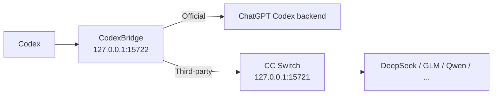

<div align="center">

# CodexBridge

**Switch providers, not conversations.**  
Move between **OpenAI Official**, **DeepSeek**, **GLM**, and **Qwen** in Codex while keeping the same conversation usable whenever possible.

[Download](../../releases) · [简体中文](README.md) · [How it works](docs/ARCHITECTURE.md) · [Compatibility](docs/COMPATIBILITY.md)

[](../../actions/workflows/build-windows-release.yml)
[](../../actions/workflows/build-macos-release.yml)
[](../../releases)
[](LICENSE)
[](#compatibility)

</div>

> CodexBridge is an **unofficial CC Switch companion**. It is not an official OpenAI or CC Switch component.

## 30-second overview

If you use **Codex + CC Switch**, you may have seen this: a conversation is still visible after switching providers, but the next message fails; tool/reasoning history is rejected by the new provider; or switching back to Official still carries stale third-party state.

CodexBridge sits between Codex and those providers:

```text
OpenAI Official
      ↓
DeepSeek
      ↓
GLM
      ↓
Qwen
      ↓
OpenAI Official

✅ Keep using the same Codex conversation whenever possible
```

It is not a model aggregator and does not replace CC Switch. Its job is **session continuity across account-authenticated Official access and API-provider access**.

## Quick start

### Easiest path: download a ZIP

If you just want to use it, you do not need to clone the repository or install Python manually.

**Option A: repository ZIP**

```text
Code → Download ZIP → extract
```

Then double-click:

```text
Windows → Start CodexBridge.cmd
macOS   → Start CodexBridge.command
```

**Option B: Windows 10/11: recommended Release ZIP**

Download from [Releases](../../releases):

```text
CodexBridge-Windows.zip
```

Extract it, then double-click:

```text
Start CodexBridge.cmd
```

First run prepares a user-local runtime and finishes setup automatically. **No administrator privileges and no manual Python installation are required.**

> The Windows Release **does not distribute a prebuilt `CodexBridge-Setup.exe`**. Do not disable Defender, disable real-time protection, or broadly whitelist the install directory just to run CodexBridge.

**Option C: macOS: Release ZIP**

Download the package for your Mac from [Releases](../../releases):

```text
Apple Silicon → CodexBridge-macOS-AppleSilicon-unsigned.zip
Intel         → CodexBridge-macOS-Intel-unsigned.zip
```

Extract it, then double-click:

```text
Start CodexBridge.command
```

macOS is currently **Beta**. The Release is not yet Apple Developer signed/notarized, so the filename includes `-unsigned`.

If Gatekeeper prompts on first launch, use Finder **Right-click → Open** once on `Start CodexBridge.command`. Do not disable Gatekeeper.

After startup, CodexBridge appears as a native Menu Bar app without a Dock icon. Login starts only the lightweight watcher; when the user opens CC Switch, the watcher starts the CodexBridge menu bar app and Bridge. CodexBridge never launches or restarts CC Switch automatically. Closing the UI does not stop the background Bridge; confirmed `Exit CodexBridge...` stops the full Launcher, Bridge, and CC Switch while keeping the watcher.

## Everyday use (Windows)

After startup, CodexBridge stays in the Windows system tray. Right-click the tray icon to use:

- **Status: ...**: view the current runtime status.
- **Restart Codex**: restart Codex manually.
- **Ensure Bridge Running**: check and recover the Bridge.
- **Pause automatic restarts**: temporarily pause automatic restart handling.
- **CC Switch watcher**: only the watcher starts at Windows sign-in; it launches full CodexBridge on a CC Switch not-running→running edge. This behavior is not user-toggleable.
- **Open Installed App Folder / Open ... Log / Open Log Folder**: open the install directory or logs.
- **Exit CodexBridge...**: stop the full Launcher, Bridge, and CC Switch. Official routes first hand off `custom` to the direct Official backend; third-party routes stop the Bridge directly. The watcher remains armed, so opening CC Switch later starts CodexBridge again.
- **Uninstall CodexBridge...**: completely uninstall CodexBridge.

Double-clicking the tray icon opens the log folder directly.

## Uninstall (Windows)

Recommended:

```text
Tray icon → Uninstall CodexBridge...
```

You can also double-click this file from the repository or Release package:

```text
Uninstall CodexBridge.cmd
```

Uninstall stops the Bridge and CC Switch, stops/removes the watcher registration, removes CodexBridge's local program files, runtime, and logs, and restores the pre-install Codex configuration when available. If a complete pre-install snapshot is unavailable, Codex falls back to the direct Official route.

**Your Codex chat history is not deleted.**

## What it does

- **Keeps one conversation usable** across Official ↔ DeepSeek / GLM / Qwen switches whenever possible.
- **Handles tool/reasoning incompatibilities** with a safe fallback instead of immediately breaking the conversation.
- **Automates switching work** such as routing, provider-scoped model lists, and required Codex restarts; unavailable third-party routes ask the user to open CC Switch instead of launching it.
- **Does not rewrite saved chat history** in `.codex/sessions`, Codex SQLite history, or `.codex/auth.json`.
- **Runs in the background after setup**, so normal use does not require manual `config.toml` edits or starting the Bridge by hand.

### Before / After

| Scenario | Without CodexBridge | With CodexBridge |
| --- | --- | --- |
| Official → DeepSeek | Existing conversation may fail | Compatibility fallback |
| DeepSeek → GLM | Tool/reasoning state may conflict | Conservative conversion |
| Back to Official | Third-party state may leak through | Returns to Official routing |
| Daily use | Manual edits / restarts may be needed | Mostly automatic |

If CodexBridge solves a workflow you rely on, a **⭐ Star** helps other people with the same problem discover it.

## Compatibility

| Route / platform | Status |
| --- | --- |
| Windows 10/11 x64 | ✅ Primary path |
| macOS Apple Silicon / Intel | 🧪 Beta / CI-validated |
| OpenAI Official | ✅ Regression-tested |
| GLM | ✅ Regression-tested |
| DeepSeek | ✅ Regression-tested |
| Qwen | ✅ Regression-tested |
| MiniMax / Claude / Gemini etc. | 🟡 Best effort; depends on whether CC Switch / the upstream exposes the Responses semantics Codex needs |
| Linux / WSL | 🧪 Developer path |

> “Regression-tested” means the current tested combination passed. It is not a promise that every future Codex, CC Switch, or provider version will behave identically.

## How it works



CodexBridge keeps a stable `custom` provider identity. **The visible Codex conversation is shared task state, while each provider's hidden state remains provider-local.** Official prefers guarded resident WebSocket continuation; third-party routes reuse provider-local cursors only when a saved checkpoint is proven safe. Every provider boundary—including third-party-to-third-party switches such as DeepSeek → GLM—uses the portable replay boundary for state that cannot safely cross providers.

If continuation cannot be proven safe, CodexBridge sends the complete current portable replay. Only after a target explicitly returns a recognized cross-provider structured-state 400/422 does the compatibility firewall perform one more conservative stateless retry. It never fabricates tool outputs and does not reinterpret ordinary authentication, quota, or model-availability errors as history-format failures.

See [docs/ARCHITECTURE.md](docs/ARCHITECTURE.md) for the full design and [docs/COMPATIBILITY.md](docs/COMPATIBILITY.md) for regression-tested vs best-effort providers.

## FAQ

<details>
<summary><strong>Does CodexBridge modify or delete my Codex history?</strong></summary>

It does not directly rewrite `.codex/sessions`, Codex SQLite history, or `.codex/auth.json`. It does update user-level Codex routing configuration and keeps backups when needed.

</details>

<details>
<summary><strong>Does CC Switch have to stay open?</strong></summary>

Official routing does not depend on CC Switch. Third-party routing uses CC Switch's local proxy; if that proxy disappears while a third-party route is active, the Launcher attempts to restore it.

</details>

<details>
<summary><strong>Do normal users need Python?</strong></summary>

No manual Python installation is required. First run prepares a user-local runtime automatically.

</details>

<details>
<summary><strong>Why not promise that every provider will always work?</strong></summary>

Providers differ in Responses, tool calls, reasoning, streaming, and continuation behavior. CodexBridge tries to make compatibility capability-driven rather than hard-coding one separate path per provider: continue when safe, fall back to full replay when needed, and fail clearly without contaminating the saved conversation when the upstream still cannot support the request.

OpenAI Official, GLM, DeepSeek, and Qwen are the current regression-tested routes; other providers are Best effort. See [Compatibility](docs/COMPATIBILITY.md).

</details>

<details>
<summary><strong>Why publish GitHub Releases instead of only offering the repository ZIP?</strong></summary>

A repository ZIP is a source snapshot. A Release binds a tested tag to platform-specific artifacts, SHA-256 integrity files, CI history, and release notes so users can download the correct Windows/macOS package and the project can identify or roll back a specific version later.

The public product version comes from [`VERSION`](VERSION). See [docs/VERSIONING.md](docs/VERSIONING.md).

</details>

## Troubleshooting

Windows logs are under:

```text
%LOCALAPPDATA%\CodexProviderBridge\launcher.log
%LOCALAPPDATA%\CodexProviderBridge\bridge-stdout.log
%LOCALAPPDATA%\CodexProviderBridge\bridge-stderr.log
```

When opening an Issue, include your Codex version, CC Switch version, provider/model, switch sequence (for example `Official → DeepSeek → Official`), and the relevant log window. Remove personal information before posting logs.

## Security and privacy

- The Bridge binds to `127.0.0.1` by default; do not expose it to the public internet.
- Do not post tokens, API keys, or unredacted logs in public Issues.
- The Windows Release ZIP does not require disabling Defender or adding broad antivirus exclusions.
- SHA-256 verifies download integrity; it is not a security certification.
- Report security-sensitive issues according to [SECURITY.md](SECURITY.md).

## Development and contributing

- Architecture: [docs/ARCHITECTURE.md](docs/ARCHITECTURE.md)
- Compatibility: [docs/COMPATIBILITY.md](docs/COMPATIBILITY.md)
- Versioning: [docs/VERSIONING.md](docs/VERSIONING.md)
- Changelog: [CHANGELOG.md](CHANGELOG.md)
- Contributing: [CONTRIBUTING.md](CONTRIBUTING.md)
- Security: [SECURITY.md](SECURITY.md)

Bug reports, compatibility tests, and PRs are welcome.

## Acknowledgements

- [CC Switch](https://github.com/farion1231/cc-switch) provides provider management and local routing.
- The OpenAI Codex / Responses ecosystem provides the client/session model this project integrates with.

CodexBridge is not officially affiliated with OpenAI, CC Switch, or their maintainers.

## License

[MIT](LICENSE)

---

<div align="center">

**If CodexBridge helps your workflow, consider giving the project a ⭐ Star.**

</div>
