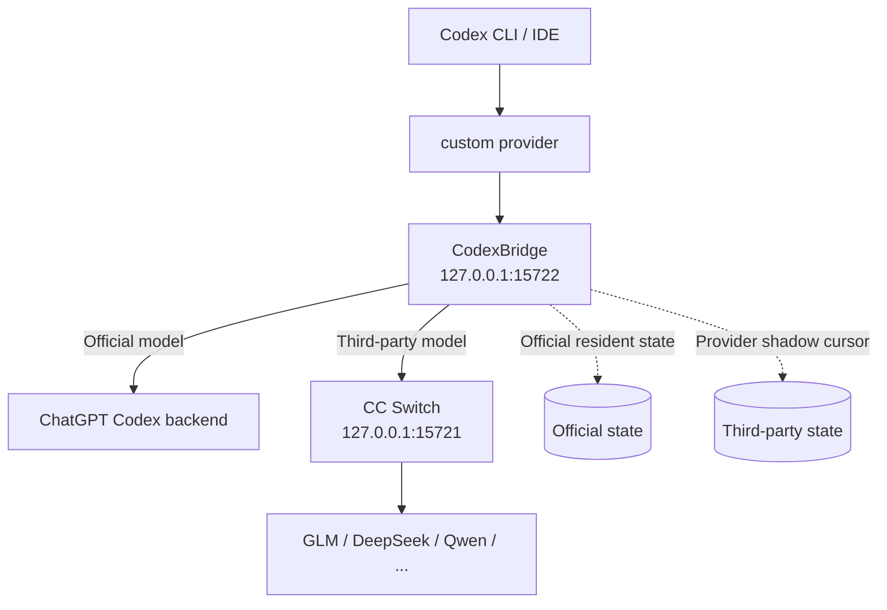

<div align="center">

# CodexBridge

**Keep one Codex conversation usable while moving between ChatGPT/Codex account-authenticated Official access and API providers.**

CodexBridge is not a model aggregator. It is a Codex **cross-auth, cross-provider, cross-backend session-continuity compatibility layer** for the boundary between account-authenticated Official Codex and API-key providers.

[简体中文](README.md) · [Architecture](docs/ARCHITECTURE.md)

[](../../actions/workflows/build-windows-release.yml)
[](../../actions/workflows/build-macos-release.yml)
[](../../releases)
[](LICENSE)
[](#project-status)

</div>

> [!IMPORTANT]
> CodexBridge is an **unofficial CC Switch companion**. It is not an official OpenAI or CC Switch component. The project is still Beta, and upstream Codex / CC Switch / API changes may require new compatibility work.

## What problem does it actually solve?

Many multi-model gateways already expose Qwen, DeepSeek, GLM, and other models behind **one API key / one fixed endpoint**. That is fundamentally an **API ↔ API** problem: Codex still talks to one API provider while the gateway switches models internally, so conversation continuity is usually much easier to preserve.

CodexBridge targets a different boundary:

```text
ChatGPT / Codex account-authenticated access
                 ↕
             CodexBridge
                 ↕
Third-party / OpenAI API-key providers
```

The core problem is therefore not “model switching.” It is:

> **Keeping the same Codex conversation as continuous as possible while switching between ChatGPT/Codex account-authenticated access and API-provider access.**

That crosses **authentication systems, providers, and backends**. Account-authenticated Official Codex and API-key providers do not naturally share the same server-side continuation state, and CodexBridge operates at that boundary.

> [!NOTE]
> If all of your models already sit behind one compatible API gateway and you can switch models inside that gateway without breaking the same Codex conversation, you may not need CodexBridge.

## Why is a session-compatibility layer still needed?

CC Switch is good at switching providers. But **a successful provider switch does not automatically mean the same Codex conversation can continue cleanly**.

A Codex context contains more than visible chat text. It may also carry `previous_response_id`, provider-owned item IDs, reasoning items, encrypted content, model names, and server-side continuation state. Those values can be valid on the provider that created them and fail when the same local conversation is replayed through another provider.

Typical symptoms include:

- an old conversation disappears after switching providers;
- the conversation is visible but the next message fails;
- `Expected an ID that begins with 'msg'`;
- `Encrypted content could not be verified/decrypted`;
- `Invalid input[…].content: array too long`;
- returning to Official still sends an old third-party model name;
- every switch replays the whole conversation and fresh input/token usage spikes.

CodexBridge does not replace CC Switch and is not another model aggregator. It adds the missing **Codex session-continuity layer between account-authenticated subscription access and API-provider access**.

## Installation (normal users only need this)

### Easiest path: download the Release ZIP

Most users do not need to clone the repository or run commands manually. Open **Releases** and download the ZIP for your platform:

- **Windows 10/11 x64**: `CodexBridge-Windows.zip`
- **macOS Apple Silicon (M1/M2/M3/M4...)**: `CodexBridge-macOS-AppleSilicon.zip`
- **macOS Intel**: `CodexBridge-macOS-Intel.zip`

Extract it, then double-click:

```text
Windows → Start CodexBridge.cmd
macOS   → Start CodexBridge.command
```

Each formal Release ZIP is published with a matching `.sha256` file for download-integrity verification.

### Windows 10/11: use the Release ZIP

Use **`CodexBridge-Windows.zip`** from Releases:

1. Download and extract `CodexBridge-Windows.zip`;
2. double-click **`Start CodexBridge.cmd`**;
3. after first-run setup completes, use CC Switch / Codex normally.

First run prepares a user-local Python runtime, compiles the small tray Launcher locally, and installs CodexBridge under `%LOCALAPPDATA%\CodexProviderBridge`. **No manual Python installation and no administrator privileges are required.** The Launcher then owns the watcher, switch detection, and normal uninstall entry points.

> [!IMPORTANT]
> The normal Windows Release **does not distribute a prebuilt `CodexBridge-Setup.exe` or a PyInstaller one-file Bridge**. An earlier unsigned self-extracting installer triggered a Microsoft Defender ML/heuristic detection during pre-release testing, so it was removed from the normal-user distribution path. Do not disable Defender, disable real-time protection, or whitelist an entire directory just to run CodexBridge.

`CodexBridge-Windows.zip` itself contains no prebuilt `.exe`; the Launcher is compiled locally on the user's Windows machine. A SHA-256 file is published alongside the archive. **A matching SHA-256 proves file identity, not security certification.**

### macOS

Formal tagged macOS Releases continue to publish separate Apple Silicon and Intel ZIPs. GitHub Actions signs the bundled Python runtime's Mach-O executable code with **Developer ID + Hardened Runtime + secure timestamp**, then submits the archive through Apple's `notarytool`; the tagged Release asset is allowed to publish only after Apple returns `Accepted`.

Therefore:

- **formal macOS ZIPs in GitHub Releases** must pass Developer ID signing and Apple notarization;
- a manual `workflow_dispatch` can still produce an Actions artifact without Apple credentials for CI/developer testing, but that artifact is an **unsigned CI artifact**, not the normal-user release;
- `Start CodexBridge.command` is still a shell entry point, so macOS may ask for first-run approval after a browser download. If Gatekeeper blocks the first double-click, use Finder **Right-click → Open** once. Do not disable Gatekeeper.

Maintainers must configure these GitHub Actions Secrets before publishing a formal macOS tag:

```text
MACOS_CERTIFICATE_P12_BASE64
MACOS_CERTIFICATE_PASSWORD
MACOS_SIGNING_IDENTITY
APPLE_ID
APPLE_TEAM_ID
APPLE_APP_SPECIFIC_PASSWORD
```

If any are missing, normal manual CI can still run, but a **tagged macOS Release fails closed instead of publishing an unsigned package**.

### Repository source ZIP is still supported

If you do not use Releases, choose **Code → Download ZIP** on the repository. After extraction:

```text
Windows → Start CodexBridge.cmd
macOS   → Start CodexBridge.command
```

The repository ZIP is useful for development, auditing, or temporary testing; normal users should prefer the platform ZIP from Releases.

### Normal-user path

```text
Windows:
Releases → CodexBridge-Windows.zip → extract → Start CodexBridge.cmd
→ first-run runtime setup / local Launcher compile → use CC Switch / Codex normally

macOS:
Releases → Apple Silicon / Intel ZIP → extract → Start CodexBridge.command
→ formal tagged assets have passed Developer ID signing + Apple notarization
```

GitHub Actions runs regression tests on Windows and macOS runners. The Windows Release no longer uploads the legacy self-extracting Setup EXE; tagged macOS Releases publish only after signing and Apple notarization succeed.

## What happens after installation?

In normal use, you should not need to run PowerShell, edit `config.toml`, manually start the Bridge, or babysit CC Switch restarts.

| Scenario | CodexBridge behavior |
| --- | --- |
| Switch to OpenAI Official | Bridge routes directly to the ChatGPT Codex backend and keeps reusable Official resident state |
| Switch to GLM / DeepSeek / Qwen | Bridge routes through CC Switch on `127.0.0.1:15721` and maintains provider-specific continuation state |
| CC Switch is closed while a third-party route is active | Launcher detects that `:15721` disappeared and relaunches CC Switch instead of silently falling back to Official |
| Codex auth/model state must be refreshed after a switch | Launcher performs the required Codex / CC Switch restart automatically |
| Active provider changes | Codex model picker exposes only the active provider's models |
| Tray `Exit Everything...` | Shows a confirmation warning first; if confirmed, stops Launcher, Bridge, and CC Switch while leaving the lightweight CC Switch trigger watcher armed; does not rewrite `config.toml`, switch to native Official, or restart Codex |
| CC Switch is closed on Official | No action; Official keeps working through the resident Bridge |
| CC Switch is closed on a third-party route | Restores only the `:15721` proxy; provider/model stay unchanged and Codex is not restarted merely for proxy recovery |

## Core capabilities

### 🔁 Cross-provider conversation continuity

CodexBridge keeps a stable:

```toml
model_provider = "custom"
```

Provider switching is represented by Bridge routing and provider-scoped catalogs instead of moving a Codex conversation between unrelated provider buckets.

### 🧠 Provider-specific continuation state

Different providers cannot read each other's internal prompt/KV cache. CodexBridge does not pretend that cache is portable. Instead, it maintains separate continuation state:

> **Correctness-first:** for complex Codex agent/tool workflows, correctness wins over token savings. Since v2.12, third-party durable delta is used only for completion-verified, tool-free, instruction-stable conversations; everything else falls back to a full portable replay.

- **Official**: guarded resident WebSocket continuation;
- **Third-party**: shadow cursors are isolated by Codex's `x-client-request-id` thread identity (hashed) when available, falling back to a conversation fingerprint only on older clients. Durable `previous_response_id` is used only in safe cases; tool-bearing agent tasks do **not** reuse a shadow cursor by default;
- on return to a provider, CodexBridge prefers sending only the conversation delta that provider has not seen when the safety guards pass.

This can reduce full-history replay, but it **cannot force a provider's billing system to report a prompt-cache hit**.

### 🧯 Third-party Compatibility Firewall

Cross-provider history can contain more than text: tool calls/outputs, reasoning items, item references, encrypted content, and provider-private state can all become invalid on a different backend. CodexBridge now adds a **failure-triggered only** compatibility firewall for third-party Responses routes:

```text
normal request → success: keep the existing path unchanged
             ↓ 400 / 422 clearly caused by cross-provider state incompatibility
safe portable replay: remove non-portable provider state and repair tool pairing
             ↓
success: continue the same conversation
failure: return the real upstream error; never forge tool output or rewrite saved history
```

Complete tool call/output pairs are preserved. Dangling tool calls, orphan outputs, and non-portable reasoning/item-reference/compaction/encrypted state are conservatively removed only in the fallback replay. Authentication errors, rate limits, missing models, ordinary 5xx failures, and `RESPONSES_MODEL_NOT_SUPPORTED` are not silently reclassified as history-compatibility errors.

### 🧩 Provider-scoped model picker

When GLM is active, the picker shows GLM-route models. When you return to Official, it shows Official models. CodexBridge may keep learned metadata internally, but it no longer mixes all known providers into the visible model list.

### 🛡️ No history-file rewriting

CodexBridge does not need to directly rewrite:

- `.codex/sessions`;
- Codex SQLite history databases;
- `.codex/auth.json`.

Compatibility handling happens in the routing/continuation layer instead of permanently mutating saved conversation history.

### 🖥️ Install once, then let the launcher manage the lifecycle

The Windows Launcher handles:

- Bridge lifecycle;
- CC Switch proxy supervision;
- provider-switch detection;
- required Codex / CC Switch restarts;
- provider-scoped model catalogs;
- Windows/CC Switch wake-up behavior;
- logs and diagnostics.

### 🗑️ Standard uninstall (Windows)

After installation, choose **Uninstall CodexBridge...** from the tray, uninstall **CodexBridge** from Windows **Settings → Apps → Installed apps**, or run `Uninstall CodexBridge.cmd` from the repository root.

Uninstall stops Bridge / CC Switch, removes Windows startup and the CC Switch watcher, restores the pre-install Codex configuration, and removes the program, runtime, and logs under `%LOCALAPPDATA%\CodexProviderBridge`. Codex chat history is not deleted.

## Architecture



While CodexBridge is active:

```text
Codex
  ↓
model_provider = custom
  ↓
127.0.0.1:15722  CodexBridge
  ├─ Official → ChatGPT Codex backend
  └─ Third-party → 127.0.0.1:15721 → CC Switch → Provider
```

On `Exit Everything...`, CodexBridge stops the tray launcher, Bridge, and CC Switch without rewriting `config.toml` or restarting Codex. The lightweight CC Switch trigger watcher remains armed so opening CC Switch later can relaunch CodexBridge automatically.

See [docs/ARCHITECTURE.md](docs/ARCHITECTURE.md) for the routing/state model.

## Token usage and prompt cache

> [!NOTE]
> **OpenAI's internal prompt cache cannot be read by GLM / DeepSeek / Qwen, and vice versa.**

What CodexBridge can control is whether it needs to resend the full conversation and whether it can reuse a provider's own continuation cursor. It cannot translate one provider's hidden KV/cache state into another provider's format.

Therefore:

- the first visit to a new provider can still require substantial context;
- returning to a provider with reusable state can send only unseen delta;
- actual fresh/cached-token accounting still depends on that provider's backend;
- if a third-party endpoint does not support durable `previous_response_id`, CodexBridge safely falls back to a compatible replay.

## Compatibility

The normal-user target is **Windows 10/11 x64 + macOS Intel + macOS Apple Silicon**. Windows uses `CodexBridge-Windows.zip` from Releases; macOS uses the architecture-matched Apple Silicon / Intel ZIP.

| Route / platform | Status | Notes |
| --- | --- | --- |
| Windows 10/11 x64 | ✅ Primary | Release `CodexBridge-Windows.zip` → extract → `Start CodexBridge.cmd`; no prebuilt EXE in the download, first-run setup happens locally |
| Windows ARM64 | 🟡 Compatibility path | Source bootstrap can select the ARM64 embeddable Python runtime, but additional real-device regression is still recommended |
| macOS Apple Silicon | 🟡 CI-validated + release gate | Dual-arch CI is covered; tagged assets publish only after Developer ID signing + Apple notarization succeed |
| macOS Intel | 🟡 CI-validated + release gate | Same as Apple Silicon; without physical-Mac regression, CI success is not presented as frictionless end-user validation |
| OpenAI Official | ✅ Regression-tested | Bridge connects directly to the ChatGPT Codex backend |
| GLM | ✅ Regression-tested | CC Switch Responses route; cross-provider long-history/tool workflows covered |
| DeepSeek | ✅ Regression-tested | Tool-bearing cross-provider fallback / compatibility firewall covered |
| Qwen | ✅ Regression-tested | Same-conversation Official ↔ third-party switching with tool history covered |
| MiniMax / Claude / Gemini etc. | 🟡 Best effort | Works only when CC Switch / the upstream exposes the Responses semantics Codex needs; arbitrary models are not promised to be 100% compatible |
| Linux / WSL | 🧪 Developer path | Bash manager remains available, but is not the normal-user one-click path |

> [!NOTE]
> “Regression-tested” means the current tested combination passed; it is not a promise that every future Codex, CC Switch, or provider version will remain identical. The product-level safety goal is: continue when compatible, use a safe portable replay when possible, and fail clearly without contaminating saved conversation state when the upstream still cannot support the request.

> [!WARNING]
> CodexBridge is **not** a generic Anthropic / Gemini / Chat Completions ↔ Responses protocol converter. Protocol adaptation remains the responsibility of CC Switch or another upstream compatibility layer.
## Project status

Current status: **Beta**.

The project currently focuses on:

- same-conversation Official ↔ third-party switching;
- Official resident continuation across Codex restarts;
- conversation-scoped third-party shadow state;
- provider-scoped model catalogs;
- automatic CC Switch proxy recovery;
- stable `model_provider = custom` identity;
- explicit full shutdown without rewriting Codex routing or restarting Codex;
- Windows Release ZIP / local-bootstrap distribution with no prebuilt EXE in the download;
- third-party compatibility firewall for safe tool/reasoning/item-state fallback.

Areas that still need continuous regression testing include new Codex/CC Switch versions, additional providers, Realtime/Voice, complex tool items, new reasoning item shapes, and provider-specific durable-continuation behavior.

## FAQ

<details>
<summary><strong>Why keep <code>model_provider = "custom"</code> all the time?</strong></summary>

It gives Codex a stable provider identity. Official / GLM / DeepSeek switching is represented inside the Bridge through routing and model catalogs, reducing history visibility and continuation problems caused by moving the same local conversation between provider buckets.

</details>

<details>
<summary><strong>Do I need to keep the CC Switch window open on third-party routes?</strong></summary>

You do not need to babysit the window. A third-party route still depends on CC Switch's local proxy at `127.0.0.1:15721`. If the proxy disappears because CC Switch is fully closed, the Launcher attempts to restore CC Switch while the third-party route remains active.

</details>

<details>
<summary><strong>Can Official still work after I hide the tray?</strong></summary>

CodexBridge now remains the resident compatibility layer with `model_provider = "custom"` and `custom.base_url = http://127.0.0.1:15722/v1`. Hiding the tray does not hand the session back to native Official and does not stop the Bridge.

</details>

<details>
<summary><strong>Does CodexBridge modify or delete my Codex conversation history?</strong></summary>

It does not directly rewrite `.codex/sessions`, Codex SQLite history, or `.codex/auth.json`. It does modify user-level Codex routing configuration and the manager keeps configuration backups when applying changes.

</details>

<details>
<summary><strong>Why can the first GLM call still be expensive?</strong></summary>

GLM does not inherit OpenAI's internal cache. The optimization target is the return visit: after GLM has established its own continuation state, CodexBridge tries to send only the delta GLM has not seen.

</details>

<details>
<summary><strong>Do normal users need Python?</strong></summary>

No manual Python installation is required. Both the Windows Release ZIP and the repository ZIP prepare a user-local Python runtime automatically on first run; the formal Windows download no longer ships a PyInstaller standalone EXE.

</details>

## Logs and troubleshooting

Runtime logs live under:

```text
Windows:
%LOCALAPPDATA%\CodexProviderBridge\launcher.log
%LOCALAPPDATA%\CodexProviderBridge\bridge-stdout.log
%LOCALAPPDATA%\CodexProviderBridge\bridge-stderr.log

macOS:
~/Library/Application Support/CodexProviderBridge/start.log
~/Library/Application Support/CodexProviderBridge/macos-watcher.log
~/.local/state/CodexProviderBridge/bridge-stdout.log
~/.local/state/CodexProviderBridge/bridge-stderr.log
```

When opening an Issue, please include:

- Codex version;
- CC Switch version;
- provider/model;
- the switch sequence, e.g. `Official → GLM → Official`;
- the relevant time range from the three logs above;
- whether Codex or CC Switch restarted during the failure.

Remove personal paths, account names, or anything else you do not want to publish before attaching logs.

### `stream disconnected before completion`

Inspect `bridge-stderr.log` and determine whether the failure is on:

```text
Codex → :15722 Bridge
```

or:

```text
Bridge → :15721 CC Switch → Provider
```

### `10061 connection refused`

If the error points to `127.0.0.1:15722`, Codex still points at the Bridge but the resident Bridge is not listening. Run `Start CodexBridge` again to restore the resident service; if this still happens, attach the Launcher log.

## Source layout / development

Normal Windows users should use `CodexBridge-Windows.zip` from Releases, while normal macOS users should use the architecture-matched Release ZIP. The source layout below is mainly for contributors:

```text
src/
  bridge/       Python bridge core
  launcher/     Windows tray launcher / watcher
  setup/        legacy/experimental installer source (not a normal Windows Release asset)
scripts/
  build/        Windows release build scripts
  windows/      PowerShell manager
  unix/         Bash manager
assets/         icons / packaging assets
docs/           architecture notes
.github/        CI / Release workflow
```

GitHub Actions run Windows/macOS regression and packaging jobs. The Windows workflow also verifies that the formal ZIP contains no prebuilt `.exe` and that the Launcher can be compiled locally from a Unicode/space-containing path. Normal users only need the matching Release asset.

See `scripts/build/` for local development builds.

> Maintainer note for Windows: macOS `.command` / `.sh` files must keep their executable bit in Git. Run `scripts/maintainer/PrepareGitHubFromWindows.ps1` once if needed; `.gitattributes` also keeps shell files on LF line endings.

## Security and privacy

- Keep the Bridge bound to `127.0.0.1`; do not expose it on `0.0.0.0` or the public internet.
- Do not publish full logs without reviewing personal paths and provider-related information.
- The project does not migrate history by rewriting saved session files.
- This is an unofficial compatibility layer; keep normal backups of important Codex configuration and project data.
- The formal Windows Release ZIP does not distribute prebuilt EXEs; do not work around security warnings by disabling Defender or broadly excluding the install directory.
- SHA-256 verifies release-file integrity; it is not a malware-safety certificate.
- Report security-sensitive issues according to [SECURITY.md](SECURITY.md); do not paste tokens, API keys, or unredacted logs into public Issues.

## Roadmap

- [x] Continue one conversation across Official ↔ third-party routes
- [x] Official resident continuation
- [x] Conversation-scoped third-party shadow state
- [x] Provider-scoped model picker
- [x] CC Switch proxy supervisor
- [x] Repository-ZIP double-click quick start (Windows + macOS)
- [x] Windows user-local runtime / tray watcher
- [x] macOS user-local runtime / LaunchAgent watcher
- [x] GitHub Actions cross-platform CI
- [ ] Broader provider / Codex-version regression matrix
- [x] Standard Windows uninstall entry (tray / Installed apps / uninstall script)
- [x] Windows `CodexBridge-Windows.zip` normal-user Release path with no prebuilt EXE in the download
- [ ] Re-evaluate a standard MSI / signed installer after code signing is available
- [ ] macOS `.dmg` / `.pkg` and a cleaner cross-platform install / update lifecycle
- [ ] Portable handoff / lazy replay for reducing first-visit context cost
- [ ] Upstream CC Switch lifecycle hook / companion integration

## Contributing

Bug reports, compatibility tests, and PRs are welcome. See [CONTRIBUTING.md](CONTRIBUTING.md) for the full contribution guide.

For larger changes, open an Issue first and include:

1. the real workflow you are trying to fix;
2. current behavior;
3. expected behavior;
4. Codex / CC Switch / provider versions;
5. whether the change affects existing continuation state or routing.

The main design principle is: **do not damage an existing conversation; prefer a safe fallback when continuation cannot be proven safe.**

## Acknowledgements

- [CC Switch](https://github.com/farion1231/cc-switch) provides provider management and local routing;
- the OpenAI Codex / Responses ecosystem provides the client/session model this project integrates with.

CodexBridge is not officially affiliated with OpenAI, CC Switch, or their maintainers.

## License

[MIT](LICENSE)

---

<div align="center">

If CodexBridge solves a workflow you rely on, a **⭐ Star** helps other people with the same problem discover it.

</div>
