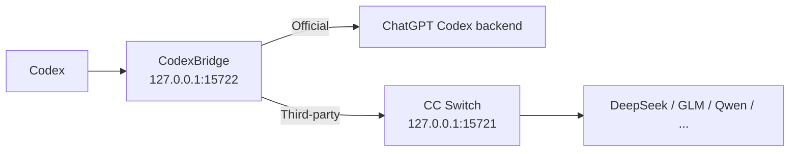

> **This project is under maintenance. Please wait patiently.**

<div align="center">

# CodexBridge

**Switch providers, not conversations.**  
Move between **OpenAI Official**, **DeepSeek**, **GLM**, and **Qwen** in Codex while keeping the same conversation usable whenever possible.

[Download](../../releases) · [简体中文](README.md) · [How it works](docs/ARCHITECTURE.md) · [Compatibility](docs/COMPATIBILITY.md)

[](../../actions/workflows/build-windows-release.yml)
[](../../actions/workflows/build-macos-release.yml)
[](../../releases)
[](LICENSE)
[](#compatibility)

</div>

> CodexBridge is an **unofficial CC Switch companion**. It is not an official OpenAI or CC Switch component.

> **macOS users, read this first**: the Release is not Apple Developer signed or notarized (filenames include `-unsigned`), so macOS may block it on first launch. Approve it once, according to your system version:
> - **macOS 15 Sequoia and later**: open System Settings → Privacy & Security, click **Open Anyway** near the bottom, then run `Start CodexBridge.command` again.
> - **macOS 14 and earlier**: Right-click `CodexBridge.app` → Open → click Open again.
>
> Do not click "Move to Trash". If it still fails, run `Start CodexBridge.command` again and click **Repair** in the dialog (it repairs this app only and never touches system security settings). Full steps are in the macOS section below.

## 30-second overview

If you use **Codex + CC Switch**, you may have seen this: a conversation is still visible after switching providers, but the next message fails; tool/reasoning history is rejected by the new provider; or switching back to Official still carries stale third-party state.

CodexBridge sits between Codex and those providers:

```text
OpenAI Official
      ↓
DeepSeek
      ↓
GLM
      ↓
Qwen
      ↓
OpenAI Official

✅ Keep using the same Codex conversation whenever possible
```

It is not a model aggregator and does not replace CC Switch. Its job is **session continuity across account-authenticated Official access and API-provider access**.

## Quick start

> ## ⚠️ Read this first: CodexBridge does not replace CC Switch
>
> - **CodexBridge is a compatibility companion for CC Switch, not a replacement.** It only keeps the same Codex conversation usable after a provider switch; it **does not manage providers and does not own routing itself**.
> - **When you use third-party providers (DeepSeek / GLM / Qwen …), keep CC Switch open the whole time and do not close its routing / local proxy.** Third-party requests must go through CC Switch's local proxy (`127.0.0.1:15721`); if you close CC Switch, the proxy disappears and messages fail to send.
> - **CodexBridge never revives CC Switch in the background when the proxy drops or you close it, and never selects or launches it via system discovery, a remembered path, or a default install path.** If you close CC Switch by accident, just reopen it to recover; you do not need to restart CodexBridge or Codex. The single exception: in a provably-needed Provider/auth switch repair flow (identical on Windows and macOS), CodexBridge performs one controlled, bounded, loop-free restart of the already-confirmed-and-bound CC Switch instance to repair the login state.
> - Only the **OpenAI Official** route does not depend on CC Switch and keeps working while CC Switch is closed.
>
> In short: CC Switch chooses which provider is used; CodexBridge keeps the same conversation usable after the switch. For third-party providers, keep both running.

### First-time use (correct order)

1. **First decide whether you need CC Switch — it is a routing entry point, not a prerequisite for a Codex conversation to exist or be resumed:**
   - If you are about to use, or switch to, a **third-party provider configured through CC Switch** (DeepSeek / GLM / Qwen …), **install and open CC Switch first** and configure the providers you want. Adding, removing, and switching providers is always CC Switch's job.
   - If you are only **signing in to OpenAI Official** and continuing an old Codex conversation, you do **not** need to open CC Switch first just because that conversation once went through a third party. Whether CC Switch is required depends only on “does the current request route through it”, not on “did this historical conversation once use a third party”.
2. **Then double-click to start CodexBridge**: on Windows double-click `Start CodexBridge.cmd`; on macOS double-click `Start CodexBridge.command`. First run prepares a user-local runtime automatically. **No administrator privileges and no manual Python installation are required.**
3. **Open Codex and use it normally**. To change provider, switch inside CC Switch; CodexBridge automatically handles Bridge routing, the model list, and any required Codex restart.
4. **Keep CC Switch open the whole time when using third-party providers**. After startup CodexBridge stays resident in the system tray / menu bar and works in the background, so you never edit `config.toml` by hand and never restart CC Switch after each switch.

### Easiest path: download a ZIP

If you just want to use it, you do not need to clone the repository or install Python manually.

**Option A: repository ZIP**

```text
Code → Download ZIP → extract
```

Then double-click:

```text
Windows → Start CodexBridge.cmd
macOS   → Start CodexBridge.command
```

**Option B: Windows 10/11: recommended Release ZIP**

Download from [Releases](../../releases):

```text
CodexBridge-Windows.zip
```

Extract it, then double-click:

```text
Start CodexBridge.cmd
```

First run prepares a user-local runtime and finishes setup automatically. **No administrator privileges and no manual Python installation are required.**

> The Windows Release **does not distribute a prebuilt `CodexBridge-Setup.exe`**. Do not disable Defender, disable real-time protection, or broadly whitelist the install directory just to run CodexBridge.

**Option C: macOS: Release ZIP**

Download the package for your Mac from [Releases](../../releases):

```text
Apple Silicon → CodexBridge-macOS-AppleSilicon-unsigned.zip
Intel         → CodexBridge-macOS-Intel-unsigned.zip
```

Extract it, then double-click:

```text
Start CodexBridge.command
```

macOS is currently **Beta**. The Release is not yet Apple Developer signed/notarized, so the filename includes `-unsigned`.

If macOS blocks the first launch, approve it once according to your system version:

- **macOS 15 Sequoia and later**: open System Settings → Privacy & Security, click **Open Anyway** near the bottom, then run `Start CodexBridge.command` again.
- **macOS 14 and earlier**: in Finder, **Right-click → Open** `CodexBridge.app`, then click **Open** again.

Do not click "Move to Trash" and do not disable Gatekeeper. The startup script **verifies the menu bar process actually started** and prints `[CodexBridge] Ready.` only after it confirms success. If it fails, it shows a dialog in your system language with a one-click **Repair** button (the script repairs `CodexBridge.app` only and never touches system security settings). See the macOS section below for the full steps.

After startup, CodexBridge appears as a native Menu Bar app without a Dock icon. Login starts only the lightweight watcher; when the user opens CC Switch, the watcher starts the CodexBridge menu bar app and Bridge. CodexBridge never revives CC Switch in the background on a proxy drop or after you close it, and never launches it via discovery/remembered/default paths; the single exception is the Provider/auth switch repair flow, where - when provably needed - it performs one controlled restart of the currently-bound CC Switch instance to repair the login state (same as Windows). Closing the UI does not stop the background Bridge; confirmed `Exit CodexBridge...` stops the full Launcher, Bridge, and CC Switch while keeping the watcher.

### macOS: prerequisites and first-time use

macOS is currently **Beta / CI-validated**, and the Release is `-unsigned` (not yet Apple Developer signed/notarized); the first launch needs one approval (see Option C above). The author has not done on-device regression for every macOS version / chip / Codex version combination, so please note all three when reporting an issue.

First, decide which case applies to you:

- **Case A: OpenAI Official only** (including repairing old conversations that previously went through a third party and stopped sending after switching back to Official) — **you do not need to install CC Switch**.
- **Case B: switching between Official ↔ third-party providers** — **you must install and run CC Switch**; third-party requests go through its local proxy (`127.0.0.1:15721`).

> CodexBridge does not replace CC Switch: **only third-party routes need CC Switch**, so Official-only use can skip it. For an old Official conversation that once went through a third party, after switching back to Official CodexBridge itself handles the leftover cross-provider state (`previous_response_id` / reasoning / item / tool); you do **not** need to reinstall or reconnect the original third-party provider for it.

#### Case A: Official only (no CC Switch needed)

Prerequisites: Codex is installed and ChatGPT Official sign-in works.

1. Download and extract the package for your chip: Apple Silicon → `CodexBridge-macOS-AppleSilicon-unsigned.zip`; Intel → `CodexBridge-macOS-Intel-unsigned.zip`.
2. Double-click **`Start CodexBridge.command`**. If macOS blocks the first launch, approve it once using the step for your system version in Option C. After setup you can delete the extracted download folder: the Bridge runs from its private copy under `Application Support` and no longer depends on the folder.
3. Watch the terminal: **it only truly started when you see `[CodexBridge] Ready.` together with `Menu bar launcher: running`**. If it shows `Launcher failed to start`, the script opens the folder and shows a dialog in your system language; click **Repair** in that dialog to have the script repair `CodexBridge.app` locally (re-sign plus removing that app's quarantine flag); it reopens automatically when the repair succeeds.
4. Click the **CodexBridge** menu bar icon and confirm **Status = Running** and **Route = Official**.
5. Open your existing Codex conversation and keep sending.

#### Case B: Official ↔ third-party switching (CC Switch required)

Additional prerequisites: CC Switch is installed and running, its Codex local proxy (`127.0.0.1:15721`) is healthy, and at least one third-party provider (DeepSeek / GLM / Qwen …) is configured in CC Switch.

1. Open **CC Switch** (CodexBridge never launches it via a discovered/default path and never revives it on a drop or after you close it; it only restarts the already-bound instance during a provably-needed switch repair).
2. Start CodexBridge using Case A steps 1–3. After you open CC Switch, the login watcher also starts CodexBridge automatically on the next CC Switch launch.
3. Confirm the menu bar shows **Status = Running** and **Route = the current third party**. If it shows **Third-party unavailable (open CC Switch)**, CC Switch is closed or its proxy is not up — just open it; CodexBridge never launches it back.
4. Switch provider inside **CC Switch**.
5. Return to the original Codex conversation and keep sending. After a switch you do **not** need to restart CC Switch or edit `config.toml` by hand; if a login-state repair is provably needed, CodexBridge automatically performs one controlled restart of the bound CC Switch instance and reloads Codex (same as Windows).

> **Conversation-migration toggle**: CodexBridge implements cross-provider session continuity on its own and does **not** depend on CC Switch's “conversation migration” toggle. Please note that toggle's state when reporting an issue, but we never insist that you must turn it on or off.
> If Apple Developer ID signing + notarization is configured later (already reserved in CI), the one-time approval step disappears too. The current build has no Apple signature, but the bundled `CodexBridge.app` now carries a complete local (ad-hoc) signature: freshly downloaded packages no longer show the “is damaged, move to Trash” dialog and go through the normal Open Anyway / Right-click → Open flow. In the rare case it still fails, click **Repair** in the startup script dialog.

## Everyday use (Windows)

After startup, CodexBridge stays in the Windows system tray. Right-click the tray icon to use:

- **Status: ...**: view the current runtime status.
- **Restart Codex**: restart Codex manually.
- **Ensure Bridge Running**: check and recover the Bridge.
- **Pause automatic restarts**: temporarily pause automatic restart handling.
- **CC Switch watcher (background component; no separate tray action)**: only the lightweight watcher starts at Windows sign-in. If CC Switch is already running, sign-in is not treated as a new-open event; the full CodexBridge starts only on a later not-running→running edge. This behavior is not user-toggleable.
- **Open Installed App Folder / Open ... Log / Open Log Folder**: open the install directory or logs.
- **Exit CodexBridge...**: stop the full Launcher, Bridge, and CC Switch. Official routes first hand off `custom` to the direct Official backend; third-party routes stop the Bridge directly. The watcher remains armed, so opening CC Switch later starts CodexBridge again.
- **Uninstall CodexBridge...**: completely uninstall CodexBridge.

Double-clicking the tray icon opens the log folder directly.

While CodexBridge is active, Task Manager may show two `CodexBridgeLauncher.exe` processes: `--watch-ccswitch` is the invisible background watcher, while `--installed` or `--ccswitch-trigger` is the tray Launcher. They are not two full Bridges; a single-instance mutex allows at most one full Launcher.

## Uninstall (Windows)

Recommended:

```text
Tray icon → Uninstall CodexBridge...
```

You can also double-click this file from the repository or Release package:

```text
Uninstall CodexBridge.cmd
```

Uninstall stops the Bridge and CC Switch, stops/removes the watcher registration, removes CodexBridge's local program files, runtime, and logs, and restores the pre-install Codex configuration when available. If a complete pre-install snapshot is unavailable, Codex falls back to the direct Official route.

**Your Codex chat history is not deleted.**

## What it does

- **Keeps one conversation usable** across Official ↔ DeepSeek / GLM / Qwen switches whenever possible.
- **Handles tool/reasoning incompatibilities** with a safe fallback instead of immediately breaking the conversation.
- **Automates switching work** such as routing, provider-scoped model lists, and required Codex restarts; unavailable third-party routes ask the user to open CC Switch instead of launching it.
- **Does not rewrite saved chat history** in `.codex/sessions`, Codex SQLite history, or `.codex/auth.json`.
- **Runs in the background after setup**, so normal use does not require manual `config.toml` edits or starting the Bridge by hand.

### Before / After

| Scenario | Without CodexBridge | With CodexBridge |
| --- | --- | --- |
| Official → DeepSeek | Existing conversation may fail | Compatibility fallback |
| DeepSeek → GLM | Tool/reasoning state may conflict | Conservative conversion |
| Back to Official | Third-party state may leak through | Returns to Official routing |
| Daily use | Manual edits / restarts may be needed | Mostly automatic |

If CodexBridge solves a workflow you rely on, a **⭐ Star** helps other people with the same problem discover it.

## Compatibility

| Route / platform | Status |
| --- | --- |
| Windows 10/11 x64 | ✅ Primary path |
| macOS Apple Silicon / Intel | 🧪 Beta / CI-validated |
| OpenAI Official | ✅ Regression-tested |
| GLM | ✅ Regression-tested |
| DeepSeek | ✅ Regression-tested |
| Qwen | ✅ Regression-tested |
| MiniMax / Claude / Gemini etc. | 🟡 Best effort; depends on whether CC Switch / the upstream exposes the Responses semantics Codex needs |
| Linux / WSL | 🧪 Developer path |

> “Regression-tested” means the current tested combination passed. It is not a promise that every future Codex, CC Switch, or provider version will behave identically.

## How it works



CodexBridge keeps a stable `custom` provider identity. **The visible Codex conversation is shared task state, while each provider's hidden state remains provider-local.** Official prefers guarded resident WebSocket continuation; third-party routes reuse provider-local cursors only when a saved checkpoint is proven safe. Every provider boundary—including third-party-to-third-party switches such as DeepSeek → GLM—uses the portable replay boundary for state that cannot safely cross providers.

If continuation cannot be proven safe, CodexBridge sends the complete current portable replay. Only after a target explicitly returns a recognized cross-provider structured-state 400/422 does the compatibility firewall perform one more conservative stateless retry. It never fabricates tool outputs and does not reinterpret ordinary authentication, quota, or model-availability errors as history-format failures.

See [docs/ARCHITECTURE.md](docs/ARCHITECTURE.md) for the full design and [docs/COMPATIBILITY.md](docs/COMPATIBILITY.md) for regression-tested vs best-effort providers.

## FAQ

<details>
<summary><strong>Does CodexBridge modify or delete my Codex history?</strong></summary>

It does not directly rewrite `.codex/sessions`, Codex SQLite history, or `.codex/auth.json`. It does update user-level Codex routing configuration and keeps backups when needed.

</details>

<details>
<summary><strong>Does CC Switch have to stay open?</strong></summary>

Yes when you use third-party providers (DeepSeek / GLM / Qwen …): third-party requests must go through CC Switch's local proxy (`127.0.0.1:15721`). When that proxy disappears CodexBridge only tells you to open CC Switch; it **never revives it on a drop or after you close it, and never launches it via discovery/remembered/default paths**. Reopen CC Switch and the third-party route recovers automatically. The single exception is the Provider/auth switch repair flow (identical on Windows and macOS): when provably needed, CodexBridge performs one controlled restart of the currently-bound CC Switch instance to repair the login state. Only the **OpenAI Official** route does not depend on CC Switch and keeps working while it is closed.

</details>

<details>
<summary><strong>Why do messages fail after switching to a third party, and why does reopening CC Switch fix it?</strong></summary>

Because the third-party request path is: **Codex → CodexBridge (`127.0.0.1:15722`) → CC Switch local proxy (`127.0.0.1:15721`) → DeepSeek / GLM / Qwen**.

CodexBridge keeps Codex's `base_url` pinned to the local Bridge, so a switch does not leave `base_url` pointing directly at one provider and bypassing the CC Switch proxy (this is exactly why you previously had to restart CC Switch to recover after a third-party switch). But the Bridge does not aggregate models over the internet by itself; it still hands third-party requests to CC Switch's proxy port.

So whenever **CC Switch is not open**, nothing is listening on `127.0.0.1:15721` and third-party messages cannot be sent; **reopening CC Switch recovers it** without restarting CodexBridge or Codex. This is why CodexBridge is a companion to CC Switch, not a replacement.

</details>

<details>
<summary><strong>Why does restarting only Codex (not CC Switch) after Official → third-party drop me to the login screen?</strong></summary>

**Bottom line: on both Windows and macOS, CodexBridge now completes "restart CC Switch → restart Codex" automatically in the switch repair flow, so you do nothing and never see a login screen.** The manual equivalent is: restart CC Switch, then restart Codex. Only "restarting Codex without restarting CC Switch" drops you to the login screen.

This is a known interaction between CC Switch's credential management and CodexBridge's routing pin, not a broken session continuation:

- CC Switch manages Codex's ChatGPT OAuth itself. When you switch to a third-party provider, it does **not** keep the ChatGPT tokens as live credentials in Codex's `auth.json` (it moves to API-key / managed-stub mode).
- To keep one conversation usable across providers, CodexBridge pins the active provider to `custom` and always sets `requires_openai_auth = true` (i.e. Codex must use ChatGPT credentials).
- So in third-party mode the config demands ChatGPT credentials while none are live on disk. A running Codex masks this with its in-memory token; **once you restart Codex**, it re-reads disk credentials → finds none → shows the login screen.
- Restarting CC Switch (or switching back to Official) restores a consistent credential state, which is why "restart CC Switch" appears to fix it; restarting only Codex exposes the mismatch.

**If you still land on the login screen (e.g. the auto-repair could not complete)**: click "Sign in with ChatGPT" once on the login screen; or reopen CC Switch so it restores a consistent state; or switch back to Official. Afterwards CodexBridge keeps the route pinned to the local Bridge and your conversation is unaffected. By design CodexBridge never writes `auth.json`, so it cannot refill the credential for you; the auto-repair (Windows/macOS) only restarts the bound CC Switch instance and lets CC Switch rewrite the credential itself.

</details>

<details>
<summary><strong>Do normal users need Python?</strong></summary>

No manual Python installation is required. First run prepares a user-local runtime automatically.

</details>

<details>
<summary><strong>Why not promise that every provider will always work?</strong></summary>

Providers differ in Responses, tool calls, reasoning, streaming, and continuation behavior. CodexBridge tries to make compatibility capability-driven rather than hard-coding one separate path per provider: continue when safe, fall back to full replay when needed, and fail clearly without contaminating the saved conversation when the upstream still cannot support the request.

OpenAI Official, GLM, DeepSeek, and Qwen are the current regression-tested routes; other providers are Best effort. See [Compatibility](docs/COMPATIBILITY.md).

</details>

<details>
<summary><strong>Why publish GitHub Releases instead of only offering the repository ZIP?</strong></summary>

A repository ZIP is a source snapshot. A Release binds a tested tag to platform-specific artifacts, SHA-256 integrity files, CI history, and release notes so users can download the correct Windows/macOS package and the project can identify or roll back a specific version later.

The public product version comes from [`VERSION`](VERSION). See [docs/VERSIONING.md](docs/VERSIONING.md).

</details>

## Troubleshooting

Windows logs are under:

```text
%LOCALAPPDATA%\CodexProviderBridge\launcher.log
%LOCALAPPDATA%\CodexProviderBridge\bridge-stdout.log
%LOCALAPPDATA%\CodexProviderBridge\bridge-stderr.log
```

When opening an Issue, include your Codex version, CC Switch version, provider/model, switch sequence (for example `Official → DeepSeek → Official`), and the relevant log window. Remove personal information before posting logs.

## Security and privacy

- The Bridge binds to `127.0.0.1` by default; do not expose it to the public internet.
- Do not post tokens, API keys, or unredacted logs in public Issues.
- The Windows Release ZIP does not require disabling Defender or adding broad antivirus exclusions.
- SHA-256 verifies download integrity; it is not a security certification.
- Report security-sensitive issues according to [SECURITY.md](SECURITY.md).

## Development and contributing

- Architecture: [docs/ARCHITECTURE.md](docs/ARCHITECTURE.md)
- Compatibility: [docs/COMPATIBILITY.md](docs/COMPATIBILITY.md)
- Versioning: [docs/VERSIONING.md](docs/VERSIONING.md)
- Changelog: [CHANGELOG.md](CHANGELOG.md)
- Contributing: [CONTRIBUTING.md](CONTRIBUTING.md)
- Security: [SECURITY.md](SECURITY.md)

Bug reports, compatibility tests, and PRs are welcome.

## Acknowledgements

- [CC Switch](https://github.com/farion1231/cc-switch) provides provider management and local routing.
- The OpenAI Codex / Responses ecosystem provides the client/session model this project integrates with.

CodexBridge is not officially affiliated with OpenAI, CC Switch, or their maintainers.

## License

[MIT](LICENSE)

---

<div align="center">

**If CodexBridge helps your workflow, consider giving the project a ⭐ Star.**

</div>
