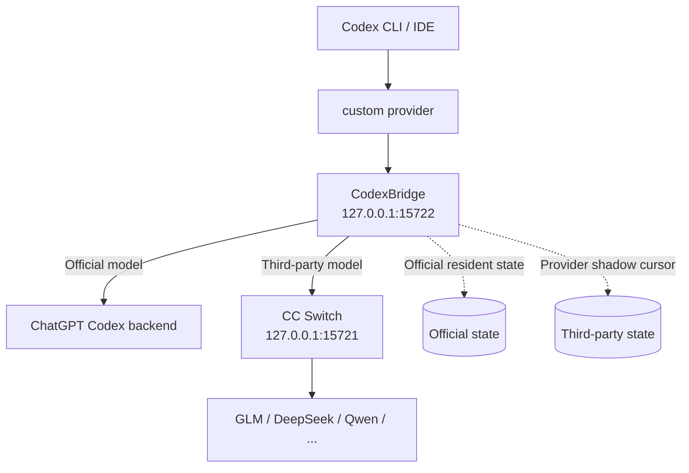

<div align="center">

# CodexBridge

**在 ChatGPT/Codex 账号订阅态与 API Provider 之间切换时，尽可能保持同一条 Codex 会话连续。**

CodexBridge 不是模型聚合器，而是面向 Codex 的 **跨认证体系、跨 Provider、跨 Backend 会话连续性兼容层**。它补上的是账号登录的 Official Codex 与 API Key Provider 之间的会话衔接。

[English](README.en.md) · [架构说明](docs/ARCHITECTURE.md)

[](../../actions/workflows/build-windows-release.yml)
[](../../actions/workflows/build-macos-release.yml)
[](../../releases)
[](LICENSE)
[](#项目状态)

</div>

> [!IMPORTANT]
> CodexBridge 是 **CC Switch 的非官方 companion**，不是 OpenAI 或 CC Switch 的官方组件。项目仍处于 Beta；Codex、CC Switch 或上游 API 的变化都可能需要重新适配。

## 它解决的到底是什么痛点？

很多多模型平台已经能用 **一个 API Key / 一个固定 Endpoint** 聚合 Qwen、DeepSeek、GLM 等模型。在这种架构里，本质上仍然是 **API ↔ API**：Codex 面对的是同一个 API Provider，平台内部再切模型，因此通常更容易保持对话连续。

CodexBridge 解决的是另一条边界：

```text
ChatGPT / Codex 账号订阅登录
            ↕
        CodexBridge
            ↕
第三方 / OpenAI API Key Provider
```

也就是说，项目真正的核心不是“模型切换”，而是：

> **让 ChatGPT/Codex 账号订阅态 ↔ API Provider 态之间切换时，同一条 Codex 会话仍尽可能连续。**

这同时跨越了 **认证体系、Provider 和 Backend**。账号登录的 Official Codex 与 API Key Provider 并不天然共享同一套服务端会话状态，CodexBridge 就工作在这条边界上。

> [!NOTE]
> 如果你的所有模型本来就已经放在同一个兼容的 API 聚合网关后面，而且在那个网关内部切模型时同一条 Codex 对话已经可以直接继续，那么你可能并不需要 CodexBridge。

## 为什么仍然需要会话兼容层？

CC Switch 很擅长切换 Provider，但 **“Provider 切换成功”并不等于“同一条 Codex 会话可以无缝继续”**。

Codex 的上下文不只有聊天文本，还可能携带 `previous_response_id`、item ID、reasoning、加密内容、模型名以及 Provider 私有的服务端状态。它们在原 Provider 上合法，跨 Provider 重放时却可能失效。

常见结果包括：

- 切换后旧会话消失，或能看到但无法继续发送；
- `Expected an ID that begins with 'msg'`；
- `Encrypted content could not be verified/decrypted`；
- `Invalid input[…].content: array too long`；
- 切回官方后仍携带旧三方模型名；
- 每次切换都重放整段上下文，fresh input/token 突然暴涨。

CodexBridge 的目标不是替代 CC Switch，也不是再做一个模型聚合平台，而是补上 **订阅账号态 ↔ API Provider 态之间的 Codex 会话连续性这一层**。

## 安装（普通用户只看这里）

### 最简单的方式：直接下载 Release ZIP

大多数用户不需要克隆仓库，也不需要手动执行命令。打开项目 **Releases**，下载自己平台对应的 ZIP：

- **Windows 10/11 x64**：`CodexBridge-Windows.zip`
- **macOS Apple Silicon（M1/M2/M3/M4…）**：`CodexBridge-macOS-AppleSilicon.zip`
- **macOS Intel**：`CodexBridge-macOS-Intel.zip`

下载后解压，然后：

```text
Windows → 双击 Start CodexBridge.cmd
macOS   → 双击 Start CodexBridge.command
```

每个正式 Release ZIP 都会同时提供对应的 `.sha256` 文件用于校验下载完整性。

### Windows 10/11：推荐 Release ZIP

Windows 正式 Release 推荐使用 **`CodexBridge-Windows.zip`**：

1. 下载并解压 `CodexBridge-Windows.zip`；
2. 双击 **`Start CodexBridge.cmd`**；
3. 首次运行完成后，正常使用 CC Switch / Codex 即可。

首次启动会自动准备用户级 Python runtime、在本机编译小型托盘 Launcher，并安装到 `%LOCALAPPDATA%\CodexProviderBridge`。**用户不需要手动安装 Python，也不需要管理员权限。** 后续仍由 Launcher 负责后台 watcher、切换检测和标准卸载入口。

> [!IMPORTANT]
> Windows 正式 Release **不再分发预编译 `CodexBridge-Setup.exe` 或 PyInstaller one-file Bridge**。此前的未签名自解压安装包在发布前测试中触发过 Microsoft Defender 的 ML/启发式检测，因此它已从普通用户发布路径中移除。不要为了运行 CodexBridge 关闭 Defender、关闭实时保护或给整个目录加白名单。

`CodexBridge-Windows.zip` 本身不包含预编译 `.exe`；首次运行需要的 Launcher 会在用户自己的 Windows 机器上由系统 C# 编译器生成。Release 同时提供 SHA-256 校验文件。**SHA-256 只能证明文件一致性，不等于安全认证。**

### macOS

正式 tag 的 macOS Release 仍分别提供 Apple Silicon 与 Intel ZIP。GitHub Actions 会先对内置 Python runtime 中的 Mach-O 可执行代码执行 **Developer ID + Hardened Runtime + secure timestamp** 签名，再通过 Apple `notarytool` 提交公证；只有 Apple 返回 `Accepted` 后，tag Release 才允许发布对应资产。

这意味着：

- **GitHub Releases 中的正式 macOS ZIP**：必须经过 Developer ID 签名和 Apple notarization；
- **手动 `workflow_dispatch` 生成的 Actions Artifact**：如果仓库没有配置 Apple 凭据，可以作为 CI/开发测试产物生成，但应视为 **unsigned CI artifact**，不是面向普通用户的正式发行包；
- `.command` 本身仍是 shell 启动脚本，因此 macOS 第一次从浏览器下载后仍可能要求用户确认。若双击被 Gatekeeper 阻止，请在 Finder 中对 `Start CodexBridge.command` **右键 → 打开** 一次；不要关闭 Gatekeeper。

维护者发布正式 macOS tag 前，需要在 GitHub Actions Secrets 中配置：

```text
MACOS_CERTIFICATE_P12_BASE64
MACOS_CERTIFICATE_PASSWORD
MACOS_SIGNING_IDENTITY
APPLE_ID
APPLE_TEAM_ID
APPLE_APP_SPECIFIC_PASSWORD
```

缺少任意一项时，普通手动 CI 仍可运行，但 **tag 的 macOS Release 会主动失败而不是发布未签名包**。

### 仓库源码 ZIP 仍然可用

不使用 Releases 时，也可以在仓库点击 **Code → Download ZIP**。解压后：

```text
Windows → Start CodexBridge.cmd
macOS   → Start CodexBridge.command
```

源码 ZIP 适合开发、审计或临时测试；普通用户优先使用 Releases 中的平台 ZIP。

### 用户实际操作路径

```text
Windows:
Releases → CodexBridge-Windows.zip → 解压 → Start CodexBridge.cmd
→ 首次自动准备 runtime / 本机编译 Launcher → 正常使用 CC Switch / Codex

macOS:
Releases → Apple Silicon / Intel 对应 ZIP → 解压 → Start CodexBridge.command
→ 正式 tag 资产已通过 Developer ID 签名 + Apple notarization
```

GitHub Actions 会分别在 Windows 与 macOS runner 上执行回归测试。Windows 正式 Release 不再上传旧的自解压 Setup EXE；macOS 正式 tag Release 则要求签名与 Apple notarization 成功后才能发布。

## 装完以后会发生什么？

正常情况下，你不再需要手动运行 PowerShell、修改 `config.toml`、启动 Bridge 或重启 CC Switch。

| 场景 | CodexBridge 的行为 |
| --- | --- |
| 切到 OpenAI Official | Bridge 直接连接 ChatGPT Codex backend，并保留可复用的 Official resident state |
| 切到 GLM / DeepSeek / Qwen 等三方 | Bridge 通过 CC Switch `127.0.0.1:15721` 转发，并维护该 Provider 的独立 continuation state |
| 三方模式下 CC Switch 被关闭 | Launcher 检测到 `:15721` 消失后自动拉起 CC Switch，不擅自切回 Official |
| Provider 切换后 Codex 需要刷新认证/模型 | Launcher 自动执行必要的 Codex / CC Switch 重启 |
| 当前 Provider 改变 | Codex picker 只暴露当前 Provider 的模型，不再混显示其他 Provider 模型 |
| 从托盘选择 `Exit Everything...` | 先弹出警告确认；确认后停止 Launcher、Bridge 与 CC Switch，但保留轻量 CC Switch 触发监视器；不修改 `config.toml`、不切换 native Official、也不重启 Codex |
| Official 状态下关闭 CC Switch | 不做任何处理；Official 继续经常驻 Bridge 正常聊天 |
| 三方状态下关闭 CC Switch | 只自动恢复 `:15721` 代理；Provider/model 不变，也不会仅因代理恢复而重启 Codex |

## 核心能力

### 🔁 跨 Provider 会话连续性

CodexBridge 保持稳定的：

```toml
model_provider = "custom"
```

Provider 切换由 Bridge 内部路由和 provider-scoped catalog 表示，而不是让 Codex 会话在不同 provider bucket 之间来回漂移。

### 🧠 Provider 独立续接状态

不同模型服务商的内部 cache/KV state **不能互相读取**。CodexBridge 不伪装成“共享缓存”，而是为不同 Provider 分别维护状态：

> **Correctness-first:** 对复杂 Codex Agent / tool-call 工作流，正确性优先于省 token。v2.12 起，第三方只在“纯消息 + completion 已验证 + instructions 稳定”的场景使用 durable delta；其余情况自动 full replay。

- **Official**：guarded resident WebSocket continuation；
- **第三方**：优先使用 Codex `x-client-request-id` 对应的真实 thread identity（哈希后）隔离 shadow cursor；仅旧版 Codex 缺少该 header 时才回退到 conversation fingerprint。durable `previous_response_id` 只用于安全场景；**tool-bearing 长任务默认不复用 shadow cursor**，检测到工具调用、未闭合 tool chain、未验证完成态或 instruction 漂移时会完整 portable replay，优先保证任务状态不串线。
- 返回同一个 Provider 时，优先只发送该 Provider 尚未看到的 conversation delta。

这可以减少“切回来又完整重放”的成本，但 **不能保证服务商账单中的 cached tokens 一定命中**。

### 🧯 Third-party Compatibility Firewall

跨 Provider 的历史不只包含文本，还可能包含 tool call/output、reasoning、item reference、encrypted content 和 Provider 私有状态。CodexBridge 现在对第三方 Responses 路由增加了一个**失败后才触发**的兼容防火墙：

```text
正常请求 → 成功：完全保持原路径
        ↓ 400 / 422 且明确属于跨 Provider 状态不兼容
安全 portable replay：清除不可移植 Provider 状态并修复 tool 配对
        ↓
成功：继续原对话
失败：返回真实上游错误，不伪造 tool output，也不改写本地会话历史
```

完整的 tool call + output 会保留；孤立 tool call / orphan output、不可移植 reasoning/item reference/compaction/encrypted state 会在 fallback replay 中被保守移除。认证失败、rate limit、模型不存在、普通 5xx 或 `RESPONSES_MODEL_NOT_SUPPORTED` 不会被错误吞掉或当成历史兼容问题重试。

### 🧩 Provider-scoped 模型列表

切到 GLM 时只显示 GLM 路线的模型；切回 Official 后只显示 Official 模型。Bridge 内部仍保留已学习的 catalog 元数据，但不把所有 Provider 混在 Codex picker 里。

### 🛡️ 不改写你的历史文件

CodexBridge 不需要直接修改：

- `.codex/sessions`；
- Codex SQLite 历史数据库；
- `.codex/auth.json`。

跨 Provider 兼容处理发生在请求转发/续接层，而不是通过永久篡改历史文件实现。

### 🖥️ 一次安装，后台自动接管

Windows Launcher 负责：

- Bridge 生命周期；
- CC Switch proxy supervision；
- Provider 切换检测；
- 必要的 Codex / CC Switch restart；
- provider-scoped model catalog；
- 开机/CC Switch 唤醒；
- 日志与诊断入口。

### 🗑️ 标准卸载（Windows）

安装后可从托盘选择 **Uninstall CodexBridge...**，也可以在 Windows **设置 → 应用 → 已安装的应用** 中卸载 CodexBridge，或运行仓库根目录的 `Uninstall CodexBridge.cmd`。

卸载会停止 Bridge / CC Switch，移除开机启动和 CC Switch watcher，恢复安装前的 Codex 配置，并删除 `%LOCALAPPDATA%\CodexProviderBridge` 下的程序、runtime 与日志。Codex 聊天记录不会删除。

## 架构



Bridge 活跃时：

```text
Codex
  ↓
model_provider = custom
  ↓
127.0.0.1:15722  CodexBridge
  ├─ Official → ChatGPT Codex backend
  └─ Third-party → 127.0.0.1:15721 → CC Switch → Provider
```

CodexBridge 现在作为常驻兼容层保持 `model_provider = "custom"` 与 `custom.base_url = http://127.0.0.1:15722/v1`。普通用户隐藏托盘不会把会话交回原生 Official，也不会停止 Bridge。

更完整的状态机和路由说明见 [docs/ARCHITECTURE.md](docs/ARCHITECTURE.md)。

## 关于 Token / Prompt Cache

> [!NOTE]
> **OpenAI 的内部 prompt cache 不能直接给 GLM / DeepSeek / Qwen 使用，反过来也一样。**

CodexBridge 能控制的是“是否再次发送整段历史”和“是否复用该 Provider 自己的 continuation cursor”，不能把一个模型服务商内部计算好的 KV/cache 翻译给另一个服务商。

因此：

- 第一次进入一个新 Provider，仍可能需要较大的上下文；
- 返回已经建立状态的 Provider 时，Bridge 会尽量只发送新增 delta；
- 实际账单中的 fresh/cached token 仍取决于对应 Provider 的服务端实现；
- 如果某第三方不支持可持久化的 `previous_response_id`，Bridge 会安全回退到兼容 replay。

## 支持范围

当前普通用户目标是 **Windows 10/11 x64 + macOS Intel + macOS Apple Silicon**。Windows 推荐使用 Release 中的 `CodexBridge-Windows.zip`；macOS 使用与架构对应的 Apple Silicon / Intel ZIP。

| 路线 / 平台 | 状态 | 说明 |
| --- | --- | --- |
| Windows 10/11 x64 | ✅ 主路径 | Release `CodexBridge-Windows.zip` → 解压 → `Start CodexBridge.cmd`；无预编译 EXE，首次本机初始化 |
| Windows ARM64 | 🟡 兼容路径 | 源码 bootstrap 能选择 ARM64 Python embeddable runtime，但仍建议单独真机回归 |
| macOS Apple Silicon | 🟡 CI 验证 + 安全发布门槛 | 双架构 CI 已覆盖；正式 tag 只有在 Developer ID 签名 + Apple notarization 成功后才发布 |
| macOS Intel | 🟡 CI 验证 + 安全发布门槛 | 与 Apple Silicon 相同；当前缺少真机回归时，不把 CI 通过等同于普通用户零阻碍验证 |
| OpenAI Official | ✅ 已回归 | Bridge 直接连接 ChatGPT Codex backend |
| GLM | ✅ 已回归 | 经 CC Switch Responses 路由；已覆盖跨 Provider 长历史/工具工作流 |
| DeepSeek | ✅ 已回归 | 已覆盖包含 tool history 的跨 Provider fallback / compatibility firewall |
| Qwen | ✅ 已回归 | 已覆盖同会话 Official ↔ third-party 切换与工具历史 |
| MiniMax / Claude / Gemini 等 | 🟡 Best effort | 只有在 CC Switch / 上游提供 Codex 所需的 Responses 语义时才可能工作；不承诺任意模型 100% 兼容 |
| Linux / WSL | 🧪 开发路径 | Bash manager 保留，但当前不是普通用户一键主路径 |

> [!NOTE]
> “已回归”表示当前测试组合通过，不代表未来任意 Codex、CC Switch、Provider 版本都不会变化。CodexBridge 的产品级保护目标是：能兼容就继续；能安全降级就 portable replay；仍不支持时明确失败，避免污染已有会话状态。

> [!WARNING]
> CodexBridge **不是 Anthropic / Gemini / Chat Completions ↔ Responses 的通用协议转换器**。协议适配仍由 CC Switch 或上游兼容层负责。
## 项目状态

当前为 **Beta**。

已经重点覆盖：

- Official ↔ third-party 的同会话切换；
- Codex restart 后 Official resident continuation；
- conversation-scoped third-party shadow state；
- provider-scoped model catalog；
- CC Switch proxy 自动恢复；
- `model_provider = custom` 的稳定身份；
- 常驻 Bridge 生命周期与关闭 CC Switch 后的代理恢复；
- Windows 无预编译 EXE 的 Release ZIP / 本机 bootstrap 发布路径；
- third-party compatibility firewall（tool/reasoning/item state 安全 fallback）。

仍需要持续回归的区域包括上游版本升级、新 Provider、Realtime/Voice、复杂 tool item、新 reasoning item shape，以及不同第三方对 durable continuation 的实现差异。

## 常见问题

<details>
<summary><strong>为什么一定要保留 <code>model_provider = "custom"</code>？</strong></summary>

它提供稳定的 Codex provider identity。真正的 Official / GLM / DeepSeek 等切换由 Bridge 内部路由和模型 catalog 完成，从而减少因为 provider bucket 改变导致的历史可见性/续接问题。

</details>

<details>
<summary><strong>切到三方以后，CC Switch 窗口必须一直开着吗？</strong></summary>

不需要一直盯着窗口。但三方链路依赖 CC Switch 的本地代理 `127.0.0.1:15721`。如果该代理因为 CC Switch 被完全退出而消失，Launcher 会在三方路由仍然活跃时自动尝试恢复 CC Switch。

</details>

<details>
<summary><strong>隐藏托盘以后还能继续用 Official 吗？</strong></summary>

可以。普通关闭 CC Switch 时，Official 不受影响；第三方路由会由 CodexBridge 自动恢复 CC Switch 代理。若从 CodexBridge 托盘选择 `Exit Everything...`，会先弹出警告；确认后 Launcher、Bridge 与 CC Switch 会停止，但轻量 CC Switch 触发监视器会继续等待。不会修改 `config.toml` 或重启 Codex；之后用户只需正常打开 CC Switch，CodexBridge 会自动重新启动，无需再次点击启动 CMD。

</details>

<details>
<summary><strong>它会修改或删除我的 Codex 历史吗？</strong></summary>

不会主动改写 `.codex/sessions`、Codex SQLite 历史或 `.codex/auth.json`。项目会修改用户级 Codex 配置来建立稳定路由，并在 manager 修改配置时保留备份。

</details>

<details>
<summary><strong>为什么第一次切到 GLM 仍然可能很贵？</strong></summary>

因为 GLM 第一次并没有 OpenAI 后端的内部缓存。CodexBridge 的优化重点是：在 GLM 已建立自己的 continuation state 后，再次返回 GLM 时尽可能只补发它没有看到的增量。

</details>

<details>
<summary><strong>普通用户需要 Python 吗？</strong></summary>

不需要手动安装。Windows Release ZIP 与仓库 ZIP 都会在首次运行时自动准备用户级 Python runtime；正式 Windows 下载包本身不再携带 PyInstaller standalone EXE。

</details>

## 日志与排障

运行日志默认位于：

```text
Windows:
%LOCALAPPDATA%\CodexProviderBridge\launcher.log
%LOCALAPPDATA%\CodexProviderBridge\bridge-stdout.log
%LOCALAPPDATA%\CodexProviderBridge\bridge-stderr.log

macOS:
~/Library/Application Support/CodexProviderBridge/start.log
~/Library/Application Support/CodexProviderBridge/macos-watcher.log
~/.local/state/CodexProviderBridge/bridge-stdout.log
~/.local/state/CodexProviderBridge/bridge-stderr.log
```

如果提交 Issue，请尽量附上：

- Codex 版本；
- CC Switch 版本；
- 当前 Provider / 模型；
- 发生问题前后的切换顺序，例如 `Official → GLM → Official`；
- 上面三份日志中相关时间段；
- 是否发生过 Codex / CC Switch restart。

请先删除日志中你不希望公开的路径、账号名或其他个人信息。

### `stream disconnected before completion`

先看：

```text
bridge-stderr.log
```

重点区分问题发生在：

```text
Codex → :15722 Bridge
```

还是：

```text
Bridge → :15721 CC Switch → Provider
```

### `10061 connection refused`

如果报错指向 `127.0.0.1:15722`，说明 Codex 仍指向 Bridge，但常驻 Bridge 当前没有监听。重新运行 `Start CodexBridge` 会恢复常驻服务；如果仍出现该错误，请附上 Launcher log。

## 从源码运行 / 开发

Windows 普通用户优先使用 Release 中的 `CodexBridge-Windows.zip`；macOS 普通用户优先使用与架构对应的 ZIP。下面的源码结构主要面向维护者：

```text
src/
  bridge/       Python bridge core
  launcher/     Windows tray launcher / watcher
  setup/        legacy/experimental installer source（当前不作为正式 Windows Release 资产）
scripts/
  build/        Windows release build scripts
  windows/      PowerShell manager
  unix/         Bash manager
assets/         icons / packaging assets
docs/           architecture notes
.github/        CI / Release workflow
```

GitHub Actions 在 Windows / macOS runner 上执行回归和打包测试。Windows workflow 还会检查正式 ZIP 中不存在预编译 `.exe`，并在包含中文与空格的路径里验证 Launcher 能本机编译。普通用户只需从 Release 下载对应平台的发布物。

本地开发构建入口见 `scripts/build/`。

> Windows 维护者提示：如果从 Windows 提交代码，macOS 的 `.command` / `.sh` 必须在 Git 中保留 executable bit。可运行 `scripts/maintainer/PrepareGitHubFromWindows.ps1` 一次；`.gitattributes` 会同时固定 shell 文件为 LF 换行。

## 安全与隐私

- Bridge 默认只监听 `127.0.0.1`，不要把它暴露到 `0.0.0.0` 或公网；
- 不要把包含个人路径、Provider 配置或其他敏感信息的完整日志直接公开；
- 项目不会通过“修改 session 文件”来迁移历史；
- 这是非官方兼容层，请在重要工作流中自行保留 Codex 配置与项目数据备份；
- Windows 正式 Release ZIP 不分发预编译 EXE；不要通过“关闭 Defender / 加整目录白名单”解决安全告警；
- SHA-256 用于验证发布物一致性，但不是恶意软件安全证明；
- 安全问题请优先按 [SECURITY.md](SECURITY.md) 的方式报告，不要在公开 Issue 中粘贴 token、API key 或未脱敏日志。

## Roadmap

- [x] Official ↔ third-party 同会话继续
- [x] Official resident continuation
- [x] Third-party conversation-scoped shadow state
- [x] Provider-scoped model picker
- [x] CC Switch proxy supervisor
- [x] 仓库 ZIP 直接双击启动（Windows + macOS）
- [x] Windows 用户级 runtime / tray watcher
- [x] macOS 用户级 runtime / LaunchAgent watcher
- [x] GitHub Actions 跨平台 CI
- [ ] 更完整的多 Provider / 多 Codex 版本回归矩阵
- [x] Windows 标准卸载入口（托盘 / 已安装的应用 / 卸载脚本）
- [x] Windows `CodexBridge-Windows.zip` 无预编译 EXE 的普通用户 Release 路径
- [ ] 完成代码签名后重新评估标准 MSI / 签名安装器
- [ ] macOS `.dmg` / `.pkg` 与更完整的跨平台安装/更新体验
- [ ] Portable handoff / lazy replay，降低首次进入新 Provider 的完整上下文成本
- [ ] 上游 CC Switch lifecycle hook / companion integration

## Contributing

Bug report、兼容性测试和 PR 都欢迎。完整贡献说明见 [CONTRIBUTING.md](CONTRIBUTING.md)。

如果是较大的功能改动，建议先开 Issue 描述：

1. 你想解决的真实工作流；
2. 当前行为；
3. 期望行为；
4. Codex / CC Switch / Provider 版本；
5. 是否会影响现有 continuation state 或路由。

这样更容易保持 Bridge 的核心原则：**不破坏已有会话，失败时优先安全回退。**

## 致谢

- [CC Switch](https://github.com/farion1231/cc-switch) 提供多 Provider 管理与本地路由能力；
- OpenAI Codex / Responses 生态提供本项目适配的客户端与会话模型。

CodexBridge 与 OpenAI、CC Switch 项目及其作者均无官方隶属关系。

## License

[MIT](LICENSE)

---

<div align="center">

如果 CodexBridge 确实解决了你的跨 Provider 工作流，**给项目一个 ⭐ Star** 会帮助更多遇到同样问题的人找到它。

</div>
