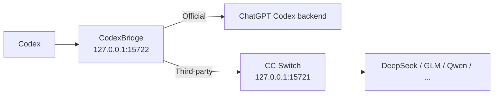

> **项目维护中，请耐心等待。**

<div align="center">

# CodexBridge

**切 Provider，不切会话。**  
在 Codex 里从 **OpenAI Official** 切到 **DeepSeek / GLM / Qwen**，再切回来，尽可能继续同一条对话。

[下载最新版](../../releases) · [English](README.en.md) · [工作原理](docs/ARCHITECTURE.md) · [兼容性](docs/COMPATIBILITY.md)

[](../../actions/workflows/build-windows-release.yml)
[](../../actions/workflows/build-macos-release.yml)
[](../../releases)
[](LICENSE)
[](#支持范围)

</div>

> CodexBridge 是 **CC Switch 的非官方 companion**，不是 OpenAI 或 CC Switch 的官方组件。

> **macOS 用户请看这里**：Release 未做 Apple Developer 签名/公证（文件名带 `-unsigned`），首次打开可能被 macOS 拦截。遇到拦截时，按系统版本放行一次：
> - **macOS 15 Sequoia 及以上**：打开 系统设置 → 隐私与安全性，点底部的“仍要打开”，再重新双击 `Start CodexBridge.command`。
> - **macOS 14 及更早**：右键 `CodexBridge.app` → 打开 → 再点“打开”。
>
> 不要点“移到废纸篓”。如果还打不开，重新双击 `Start CodexBridge.command`，在弹窗里点“帮我修复”（只修复这个 App 本身，不改系统安全设置）。详细说明见下方 macOS 小节。

## 30 秒理解

如果你正在用 **Codex + CC Switch**，可能遇到过：切 Provider 后旧对话还能看到，但继续发送会报错；tool / reasoning 历史在另一个 Provider 上不兼容；切回 Official 还残留三方状态。

CodexBridge 就是夹在 Codex 和不同 Provider 之间的兼容层：

```text
OpenAI Official
      ↓
DeepSeek
      ↓
GLM
      ↓
Qwen
      ↓
OpenAI Official

✅ 尽可能继续同一条 Codex 对话
```

它不是模型聚合器，也不替代 CC Switch；它补的是 **Official 账号态 ↔ API Provider 态之间的会话连续性**。

## 快速开始

> ## ⚠️ 开始之前必读：CodexBridge 不替代 CC Switch
>
> - **CodexBridge 是 CC Switch 的兼容层伴侣，不是替代品。** 它只负责“切 Provider 后尽量续上同一条 Codex 会话”，**不管理 Provider，也不负责路由本身**。
> - **用第三方 Provider（DeepSeek / GLM / Qwen …）时，请全程保持 CC Switch 开着，不要关闭它的路由 / 本地代理。** 第三方请求必须经过 CC Switch 的本地代理（`127.0.0.1:15721`）才能发出去；一旦关掉 CC Switch，代理消失，消息就会发送失败。
> - **CodexBridge 不会因为代理掉线或你主动关闭而后台复活 CC Switch，也不会经系统发现 / 历史路径 / 默认安装路径擅自选择并启动它。** 如果不小心关掉了 CC Switch，重新打开它即可恢复，无需重启 CodexBridge 或 Codex。唯一例外：在可证明需要的 Provider/auth 切换修复流程中（Windows 与 macOS 行为一致），CodexBridge 会对当前已确认绑定的同一个 CC Switch 实例执行一次受控、有限、无循环的重启来修复登录态。
> - 只有 **OpenAI Official** 路由不依赖 CC Switch，可以在 CC Switch 关闭时继续使用。
>
> 简言之：CC Switch 负责选用哪个 Provider，CodexBridge 负责切换之后让同一条会话继续可用。使用第三方 Provider 时，二者都需要保持运行。

### 第一次使用（正确顺序）

1. **先判断你是否需要 CC Switch——它是“路由入口”，不是 Codex 历史会话存在或恢复的前提：**
   - 如果你接下来要用、或要切换到**通过 CC Switch 配置的第三方 Provider**（DeepSeek / GLM / Qwen …），就**先安装并打开 CC Switch**，在里面配置好要用的 Provider。Provider 的添加、删除和切换始终由 CC Switch 负责。
   - 如果你现在**只登录 OpenAI Official**、继续 Codex 里以前的旧会话，**不需要**因为那条会话曾经走过第三方就先开 CC Switch。是否需要 CC Switch，只取决于“当前这条请求是否要走它”，而不取决于“这条历史会话以前是否走过第三方”。
2. **再双击启动 CodexBridge**：Windows 双击 `Start CodexBridge.cmd`，macOS 双击 `Start CodexBridge.command`。首次运行会自动准备用户级 runtime，**不需要管理员权限，也不需要手动安装 Python**。
3. **打开 Codex 正常使用**。要换 Provider 时直接在 CC Switch 里切换，CodexBridge 会自动处理 Bridge 路由、模型列表和必要的 Codex 重启。
4. **用第三方 Provider 时全程保持 CC Switch 开着**。启动后 CodexBridge 常驻系统托盘 / 菜单栏在后台工作，你不需要手动改 `config.toml`，也不需要每次切换后重启 CC Switch。

### 最省事：下载 ZIP

如果你只是想用，不需要克隆仓库，也不需要手动配置 Python。

**方式 A：直接下载仓库 ZIP**

```text
Code → Download ZIP → 解压
```

然后双击：

```text
Windows → Start CodexBridge.cmd
macOS   → Start CodexBridge.command
```

**方式 B：Windows 10/11：推荐 Release ZIP**

从 [Releases](../../releases) 下载：

```text
CodexBridge-Windows.zip
```

解压后双击：

```text
Start CodexBridge.cmd
```

首次运行会自动准备用户级 runtime 并完成初始化；**不需要管理员权限，也不需要手动安装 Python**。

> Windows 正式 Release **不再分发预编译 `CodexBridge-Setup.exe`**。不要为了运行 CodexBridge 关闭 Defender、关闭实时保护或给整个目录加白名单。

**方式 C：macOS：Release ZIP**

从 [Releases](../../releases) 下载与你的 Mac 对应的包：

```text
Apple Silicon → CodexBridge-macOS-AppleSilicon-unsigned.zip
Intel         → CodexBridge-macOS-Intel-unsigned.zip
```

解压后双击：

```text
Start CodexBridge.command
```

macOS 当前为 **Beta**。Release 暂未做 Apple Developer 签名/公证，因此文件名带 `-unsigned`。

首次打开若被 macOS 拦截，按系统版本放行一次：

- **macOS 15 Sequoia 及以上**：打开 系统设置 → 隐私与安全性，点底部的“仍要打开”，再重新双击 `Start CodexBridge.command`。
- **macOS 14 及更早**：在 Finder 里对 `CodexBridge.app` **右键 → 打开** → 再点“打开”。

不要点“移到废纸篓”，也不要关闭 Gatekeeper。启动脚本会**校验菜单栏进程是否真的起来**，只有成功才显示 `[CodexBridge] Ready.`；失败时会弹出跟随系统语言的提示，并可点“帮我修复”（脚本只对 `CodexBridge.app` 做本地修复，不改动系统安全设置）。完整步骤见下方 macOS 小节。

启动完成后，CodexBridge 会以原生 Menu Bar 应用显示在 macOS 菜单栏，不占用 Dock 图标。登录时只运行轻量 watcher；当用户打开 CC Switch，watcher 才启动 CodexBridge 菜单栏应用和 Bridge。CodexBridge 不会因代理掉线或你主动关闭而后台复活 CC Switch，也不会经发现/历史/默认路径擅自启动它；唯一例外是 Provider/auth 切换修复流程：当可证明需要时，它会对当前已绑定的同一个 CC Switch 实例做一次受控重启来修复登录态（与 Windows 一致）。普通关闭 UI 不会停止后台 Bridge，只有确认 `退出 CodexBridge...` 才会停止完整 Launcher、Bridge 和 CC Switch，同时保留 watcher。

### macOS：前提条件与第一次使用

macOS 目前是 **Beta / CI 验证**，Release 为 `-unsigned`（暂未做 Apple Developer 签名/公证），首次打开需按上文「方式 C」放行一次。作者尚未对每一种 macOS 版本 / 芯片 / Codex 版本组合做实机回归，报障时请注明这三项。

先判断你属于哪种情况：

- **情况 A：只用 OpenAI Official**（包括修复“以前经过第三方、切回 Official 就发不出去”的旧会话）——**不需要安装 CC Switch**。
- **情况 B：要在 Official ↔ 第三方 Provider 之间切换**——**必须安装并运行 CC Switch**，第三方请求要经过它的本地代理（`127.0.0.1:15721`）。

> CodexBridge 不替代 CC Switch：**只有第三方路由需要 CC Switch**，只用 Official 时可以不装。曾经经过第三方的旧 Official 会话，切回 Official 后由 CodexBridge 自行处理 `previous_response_id` / reasoning / item / tool 等跨 Provider 残留，**不需要**为了它重装或重连原来的第三方 Provider。

#### 情况 A：只用 Official（不需要 CC Switch）

前提：Codex 已安装、ChatGPT Official 登录正常。

1. 下载与芯片对应的包并解压：Apple Silicon → `CodexBridge-macOS-AppleSilicon-unsigned.zip`；Intel → `CodexBridge-macOS-Intel-unsigned.zip`。
2. 双击 **`Start CodexBridge.command`**；首次若被 macOS 拦截，按上文“方式 C”里对应你系统版本的步骤放行一次。
3. 看终端：**只有出现 `[CodexBridge] Ready.` 且 `Menu bar launcher: running` 才算真的启动成功**。若显示 `Launcher failed to start`，脚本会自动打开文件夹并弹出提示（中文系统显示中文）；点弹窗里的“帮我修复”可让脚本对 `CodexBridge.app` 做一次本地修复（本地重新签名 + 清除该应用的隔离标记），修复成功会自动重新打开。
4. 点菜单栏 **CodexBridge** 图标，确认 **状态 = 运行中**、**路由 = Official**。
5. 打开你原来的 Codex 会话，直接继续发送。

#### 情况 B：Official ↔ 第三方切换（需要 CC Switch）

额外前提：CC Switch 已安装并运行、其 Codex 本地代理（`127.0.0.1:15721`）正常、已在 CC Switch 中配好至少一个第三方 Provider（DeepSeek / GLM / Qwen …）。

1. 打开 **CC Switch**（CodexBridge 不会经发现/默认路径擅自启动它，也不会因掉线或你关闭而后台复活；仅在可证明需要的切换修复流程中重启已绑定的同一实例）。
2. 按情况 A 的步骤 1–3 启动 CodexBridge；打开 CC Switch 后，登录 watcher 也会在下一次 CC Switch 启动时自动拉起 CodexBridge。
3. 确认菜单栏 **状态 = 运行中**、**路由 = 当前第三方**。若显示 **第三方不可用（请打开 CC Switch）**，说明 CC Switch 没开或代理没起来——打开它即可，CodexBridge 不会反向拉起。
4. 在 **CC Switch** 里切换 Provider。
5. 回到原 Codex 会话继续发送。切换后**不需要你手动重启 CC Switch**，也不需要手动改 `config.toml`；若出现需要修复的登录态，CodexBridge 会自动对已绑定的 CC Switch 实例做一次受控重启并重载 Codex（与 Windows 一致）。

> **会话迁移开关**：CodexBridge 自己实现跨 Provider 会话续接，**不依赖** CC Switch 的“会话迁移”开关；报障时请注明它的状态，但我们不会武断要求你必须开或必须关。
> 若日后配置 Apple Developer ID 签名 + 公证（CI 已预留该流程），首次放行这一步也会消失。当前版本不含 Apple 签名，但包内的 `CodexBridge.app` 已带完整的本地（ad-hoc）签名：正常下载的新包不会再出现“已损坏，移到废纸篓”提示，走上面“仍要打开 / 右键打开”的常规放行即可；万一仍遇到，在启动脚本弹窗里点“帮我修复”。

## 日常使用（Windows）

CodexBridge 启动后会常驻 Windows 系统托盘。右键托盘图标可以：

- **Status: ...**：查看当前运行状态。
- **Restart Codex**：手动重启 Codex。
- **Ensure Bridge Running**：检查并恢复 Bridge。
- **Pause automatic restarts**：临时暂停自动重启处理。
- **CC Switch watcher（后台组件，无独立菜单按钮）**：Windows 登录时只启动轻量 watcher；如果 CC Switch 已经在运行，登录这一刻不会被当作新的打开事件；之后只有 CC Switch 从未运行变为运行时才启动完整 CodexBridge。该行为不可切换。
- **Open Installed App Folder / Open ... Log / Open Log Folder**：打开安装目录或日志。
- **Exit CodexBridge...**：关闭完整 Launcher、Bridge 和 CC Switch；Official 路由会先切换到 `custom` 直连 Official，第三方路由会直接停止 Bridge。watcher 会继续保留，之后重新打开 CC Switch 时 CodexBridge 会自动启动。
- **Uninstall CodexBridge...**：彻底卸载 CodexBridge。

双击托盘图标会直接打开日志目录。

正常运行时任务管理器可能看到两个 `CodexBridgeLauncher.exe`：`--watch-ccswitch` 是无界面的后台 watcher，`--installed` 或 `--ccswitch-trigger` 是托盘 Launcher。它们不是两个完整 Bridge；完整 Launcher 通过单实例互斥保证最多只有一个。

## 卸载（Windows）

推荐直接使用：

```text
托盘图标 → Uninstall CodexBridge...
```

也可以在仓库或 Release 包中双击：

```text
Uninstall CodexBridge.cmd
```

卸载会关闭 Bridge 和 CC Switch，停止并删除 watcher 注册，删除 CodexBridge 的本地程序、runtime 和日志，并优先恢复安装前的 Codex 配置；如果没有完整的安装前配置快照，则回退到直接 Official 路由。

**不会删除你的 Codex 聊天记录。**

## 它能做什么？

- **继续同一条会话**：Official ↔ DeepSeek / GLM / Qwen 切换时，尽量保持原 Codex 对话可继续。
- **兼容 tool / reasoning 历史**：跨 Provider 状态不兼容时，自动走安全 fallback，而不是直接把会话炸掉。
- **自动处理切换**：CC Switch 切 Provider 后，自动处理 Bridge 路由、模型列表和必要的 Codex 重启；第三方路由不可用时只提示用户打开 CC Switch，不会反向拉起它。
- **不改写聊天历史**：不直接修改 `.codex/sessions`、Codex SQLite 历史或 `.codex/auth.json`。
- **一次启动，后台接管**：正常使用时不需要手动改 `config.toml`、手动启动 Bridge 或盯着 CC Switch。

### Before / After

| 场景 | 没有 CodexBridge | 使用 CodexBridge |
| --- | --- | --- |
| Official → DeepSeek | 旧会话可能继续失败 | 自动兼容 / fallback |
| DeepSeek → GLM | tool / reasoning state 可能冲突 | 保守转换后继续 |
| 再切回 Official | 可能残留三方状态 | 回到 Official 路由 |
| 日常操作 | 可能手改配置 / 重启 | 尽量自动处理 |

如果 CodexBridge 正好解决了你的工作流，**⭐ Star** 可以帮助更多遇到同样问题的人发现它。

## 支持范围

| 路线 / 平台 | 状态 |
| --- | --- |
| Windows 10/11 x64 | ✅ 主路径 |
| macOS Apple Silicon / Intel | 🧪 Beta / CI 验证 |
| OpenAI Official | ✅ 已回归 |
| GLM | ✅ 已回归 |
| DeepSeek | ✅ 已回归 |
| Qwen | ✅ 已回归 |
| MiniMax / Claude / Gemini 等 | 🟡 Best effort，取决于 CC Switch / 上游是否提供 Codex 所需的 Responses 语义 |
| Linux / WSL | 🧪 开发路径 |

> “已回归”表示当前测试组合通过，不代表未来任意 Codex、CC Switch 或 Provider 版本都不会变化。

## 工作原理



CodexBridge 保持稳定的 `custom` provider 身份。**Codex 当前可见的对话历史是共同事实，但每个 Provider 的隐藏状态彼此隔离**：Official 优先使用受保护的 resident WebSocket continuation；第三方只在 checkpoint 能证明安全时复用 provider-local cursor。只要跨 Provider（包括 DeepSeek → GLM 这种三方之间切换），不能共享的 response id / reasoning / tool state 都必须经过 portable replay 边界。

如果 continuation 不能证明安全，就发送完整 portable replay；如果目标上游明确返回典型的跨 Provider structured-state 400/422，compatibility firewall 才会做一次更保守的 stateless retry。它不会为了“兼容”去伪造 tool output，也不会把普通鉴权、额度、模型不存在等错误伪装成历史格式问题。

完整设计见 [docs/ARCHITECTURE.md](docs/ARCHITECTURE.md)；已验证与 Best-effort Provider 边界见 [docs/COMPATIBILITY.md](docs/COMPATIBILITY.md)。

## 常见问题

<details>
<summary><strong>它会修改或删除我的 Codex 历史吗？</strong></summary>

不会直接改写 `.codex/sessions`、Codex SQLite 历史或 `.codex/auth.json`。它会修改用户级 Codex 路由配置，并在需要时保留配置备份。

</details>

<details>
<summary><strong>需要一直开着 CC Switch 吗？</strong></summary>

用第三方 Provider（DeepSeek / GLM / Qwen …）时**需要一直开着**：第三方请求要经过 CC Switch 的本地代理（`127.0.0.1:15721`）才能发出去。代理消失时 CodexBridge 只会提示你打开 CC Switch，**不会因掉线或你主动关闭而后台复活它，也不会经发现/历史/默认路径擅自启动**；重新打开 CC Switch 后，第三方路由会自动恢复。唯一例外是 Provider/auth 切换修复流程（Windows 与 macOS 行为一致）：当可证明需要时，CodexBridge 会对当前已绑定的同一个 CC Switch 实例做一次受控重启来修复登录态。只有 **OpenAI Official** 路由不依赖 CC Switch，可以在它关闭时继续使用。

</details>

<details>
<summary><strong>为什么切到第三方后消息发不出去，重开 CC Switch 就好了？</strong></summary>

因为第三方请求的链路是：**Codex → CodexBridge（`127.0.0.1:15722`）→ CC Switch 本地代理（`127.0.0.1:15721`）→ DeepSeek / GLM / Qwen**。

CodexBridge 会把 Codex 的 `base_url` 始终固定在本地 Bridge，避免切换后 `base_url` 被改成某个 Provider 的直连地址而绕过 CC Switch 代理（这正是过去“切完第三方要重启 CC Switch 才能恢复”的原因）。但 Bridge 自己并不联网聚合模型，它仍然要把第三方请求交给 CC Switch 的代理端口。

所以只要 **CC Switch 没开着**，`127.0.0.1:15721` 就没人监听，第三方消息发不出去；**重新打开 CC Switch 即可恢复**，不需要重启 CodexBridge 或 Codex。这也说明 CodexBridge 是 CC Switch 的伴侣，而不是替代品。

</details>

<details>
<summary><strong>为什么 Official → 三方后只重启 Codex（不重启 CC Switch）会掉到登录页？</strong></summary>

**先说结论：在 Windows 和 macOS 上，CodexBridge 现在会在切换修复流程中自动完成“重启 CC Switch → 重启 Codex”，你无需手动操作、也完全不用登录。** 手动等价顺序是：重启 CC Switch，再重启 Codex。只有“只重启 Codex、不重启 CC Switch”才会掉到登录页。

这是 CC Switch 的凭据托管与 CodexBridge 的路由钉住共同造成的**已知行为**，不是会话续接坏了：

- CC Switch 自己托管 Codex 的 ChatGPT OAuth。切到第三方 Provider 时，它**不会**把 ChatGPT tokens 继续保持为 Codex `auth.json` 里的 live 凭据（改走 API-key / 托管存根模式）。
- CodexBridge 为了让同一条会话跨 Provider 可用，会把 active provider 钉成 `custom` 并恒设 `requires_openai_auth = true`（即要求 Codex 用 ChatGPT 凭据）。
- 于是三方模式下出现“配置要求 ChatGPT 凭据、但磁盘上没有 live ChatGPT 凭据”。正在运行的 Codex 靠内存里的旧 token 掩盖；**一旦重启 Codex**，它重读磁盘凭据 → 没有 → 掉到登录页。
- 重启 CC Switch（或切回 Official）会把凭据恢复成一致态，所以“重启 CC Switch”看起来能好；只重启 Codex 则暴露这个不一致。

**如果仍掉到登录页（例如自动修复未能完成）**：在登录页点一次“通过 ChatGPT 登录”；或重开 CC Switch 让它恢复一致态；或切回 Official。恢复后 CodexBridge 会继续把路由钉在本地 Bridge，会话不受影响。CodexBridge 按设计不写 `auth.json`，因此不会替你填回凭据；自动修复（Windows/macOS）也只是重启已绑定的 CC Switch 实例，由 CC Switch 自己重写凭据。

</details>

<details>
<summary><strong>普通用户需要 Python 吗？</strong></summary>

不需要手动安装。首次运行会自动准备用户级 runtime。

</details>

<details>
<summary><strong>为什么不能保证“任何模型 100% 都能切”？</strong></summary>

不同 Provider 对 Responses、tool call、reasoning、streaming 和 continuation state 的实现并不完全一致。CodexBridge 的兼容逻辑尽量按“能力和状态安全”判断，而不是给 DeepSeek / GLM / Qwen 分别写死一套分支：能安全 continuation 就继续，不能就 full replay，仍不支持时明确失败而不是污染原会话。

目前 Official / GLM / DeepSeek / Qwen 是回归验证路径；其他 Provider 为 Best effort。详见 [兼容性说明](docs/COMPATIBILITY.md)。

</details>

<details>
<summary><strong>为什么还要发布 GitHub Release，直接下载源码 ZIP 不行吗？</strong></summary>

源码 ZIP 更像“仓库快照”；Release 把一个经过 CI 验证的 tag、平台包、SHA-256 和变更记录绑定在一起，让普通用户能下载明确的 Windows / macOS 产物，也让项目出现问题时可以准确定位和回滚到某个版本。

项目的公开版本以根目录 [`VERSION`](VERSION) 为准；版本规则见 [docs/VERSIONING.md](docs/VERSIONING.md)。

</details>

## 排障

Windows 日志默认在：

```text
%LOCALAPPDATA%\CodexProviderBridge\launcher.log
%LOCALAPPDATA%\CodexProviderBridge\bridge-stdout.log
%LOCALAPPDATA%\CodexProviderBridge\bridge-stderr.log
```

提交 Issue 时，建议附上：Codex 版本、CC Switch 版本、Provider / 模型、切换顺序（例如 `Official → DeepSeek → Official`）和相关时间段日志。请先删除你不希望公开的个人信息。

## 安全与隐私

- Bridge 默认只监听 `127.0.0.1`；不要暴露到公网。
- 不要在 Issue 中粘贴 token、API key 或未脱敏日志。
- Windows Release ZIP 不要求关闭 Defender 或添加安全白名单。
- SHA-256 用于校验下载完整性，不等于安全认证。
- 安全问题请按 [SECURITY.md](SECURITY.md) 报告。

## 开发与贡献

- 架构说明：[docs/ARCHITECTURE.md](docs/ARCHITECTURE.md)
- 兼容性矩阵：[docs/COMPATIBILITY.md](docs/COMPATIBILITY.md)
- 项目讲解 / 面试版：[docs/PROJECT_OVERVIEW.zh-CN.md](docs/PROJECT_OVERVIEW.zh-CN.md)
- 版本规则：[docs/VERSIONING.md](docs/VERSIONING.md)
- 变更记录：[CHANGELOG.md](CHANGELOG.md)
- 贡献指南：[CONTRIBUTING.md](CONTRIBUTING.md)
- 安全策略：[SECURITY.md](SECURITY.md)

Bug report、兼容性测试和 PR 都欢迎。

## 致谢

- [CC Switch](https://github.com/farion1231/cc-switch) 提供多 Provider 管理与本地路由能力；
- OpenAI Codex / Responses 生态提供本项目适配的客户端与会话模型。

CodexBridge 与 OpenAI、CC Switch 项目及其作者均无官方隶属关系。

## License

[MIT](LICENSE)

---

<div align="center">

**如果 CodexBridge 对你有用，欢迎点一个 ⭐ Star。**

</div>
