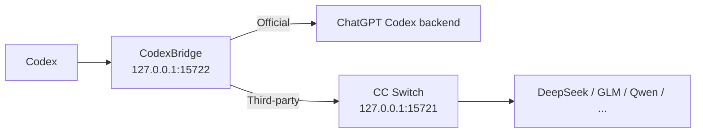

> **项目维护中，请耐心等待。**

<div align="center">

# CodexBridge

**切 Provider，不切会话。**  
在 Codex 里从 **OpenAI Official** 切到 **DeepSeek / GLM / Qwen**，再切回来，尽可能继续同一条对话。

[下载最新版](../../releases) · [English](README.en.md) · [使用说明](docs/USER_GUIDE.zh-CN.md) · [工作原理](docs/ARCHITECTURE.md) · [兼容性](docs/COMPATIBILITY.md)

[](../../actions/workflows/build-windows-release.yml)
[](../../actions/workflows/build-macos-release.yml)
[](../../releases)
[](LICENSE)
[](#支持范围)

</div>

CodexBridge 是 **CC Switch 的非官方 companion**，不是 OpenAI 或 CC Switch 的官方组件。

> **macOS 用户先看这里**：Release 未做 Apple Developer 签名和公证（文件名带 `-unsigned`），首次打开可能被系统拦下。按系统版本放行一次即可：
>
> - **macOS 15 Sequoia 及以上**：打开 系统设置 → 隐私与安全性，点底部的“仍要打开”，然后重新双击 `Start CodexBridge.command`。
> - **macOS 14 及更早**：在 Finder 里右键 `CodexBridge.app` → 打开 → 再点“打开”。
>
> 不要点“移到废纸篓”，也不要关闭 Gatekeeper。如果还是打不开，重新双击 `Start CodexBridge.command`，在弹窗里点“帮我修复”：它只对 `CodexBridge.app` 本地重新签名并清除它自己的隔离标记，不改系统安全设置。

## 它解决什么问题

用 Codex + CC Switch 切换 Provider 时，旧对话还看得到，但继续发送往往会失败：tool 和 reasoning 历史在另一个 Provider 上不被接受，切回 Official 还残留三方状态。

CodexBridge 是夹在 Codex 与各 Provider 之间的兼容层，补的是 Official 账号态和 API Provider 态之间的会话连续性。它不是模型聚合器，也不替代 CC Switch：**CC Switch 决定用哪个 Provider，CodexBridge 决定切换之后那条会话还能不能继续发下去。**

## 快速开始

1. **要用第三方 Provider（DeepSeek / GLM / Qwen …），先安装并打开 CC Switch**，在里面配好要用的 Provider。只用 OpenAI Official 就不需要装它——是否需要 CC Switch，只取决于当前这条请求要不要走它，而不取决于这条历史会话以前走过谁。
2. **双击启动 CodexBridge**：Windows 是 `Start CodexBridge.cmd`，macOS 是 `Start CodexBridge.command`。首次运行会自动准备一份用户级 Python 运行时，不需要管理员权限，不需要手动安装 Python，也不需要联网。
3. **打开 Codex 正常使用**。要换 Provider 就直接在 CC Switch 里切，Bridge 路由、模型列表和必要的 Codex 重启都由 CodexBridge 处理。
4. **用第三方 Provider 时全程保持 CC Switch 开着**。万一关掉了，重新打开即可恢复，不需要重启 CodexBridge 或 Codex。

启动后 CodexBridge 常驻系统托盘 / 菜单栏在后台工作，你不需要手动改 `config.toml`。

关于 CC Switch 有一条边界值得说清楚：

- 第三方请求必须经过它的本地代理 `127.0.0.1:15721` 才能发出去，所以它一关，消息就发不出去。
- CodexBridge 不会因为代理掉线或你主动关闭而在后台复活 CC Switch，也不会经系统发现、记住的路径或默认安装路径去选择并启动它。第三方路由不可用时，它只提示你打开 CC Switch。
- 唯一的例外是 Provider/auth 切换修复流程：当可证明需要时，它会对当前已绑定的同一个 CC Switch 实例做一次受控、有限、无循环的重启来修复登录态，Windows 与 macOS 行为一致。

这条例外的触发条件和边界写在 [使用说明](docs/USER_GUIDE.zh-CN.md) 里。

### 下载

**Windows 10/11：推荐 Release ZIP**。从 [Releases](../../releases) 下载 `CodexBridge-Windows.zip`，解压后双击 `Start CodexBridge.cmd`。

> Windows 正式 Release **不再分发预编译 `CodexBridge-Setup.exe`**。不要为了运行 CodexBridge 关闭 Defender、关闭实时保护，或给整个目录加白名单。

**macOS：Release ZIP**。按芯片从 [Releases](../../releases) 下载对应的包，解压后双击 `Start CodexBridge.command`：

```text
Apple Silicon → CodexBridge-macOS-AppleSilicon-unsigned.zip
Intel         → CodexBridge-macOS-Intel-unsigned.zip
```

也可以直接用仓库源码包（`Code → Download ZIP`），入口是同样的两个文件。

首次运行不需要联网：官方 Python 运行时已经随 Release ZIP 内置，脚本校验 SHA-256 通过后解压到你的用户目录。只有 ARM64／32 位 Windows，或内置包校验没通过时，才会改为联网下载。细节见 [使用说明](docs/USER_GUIDE.zh-CN.md)。

### macOS：确认启动成功

放行步骤见本文开头。启动脚本会校验菜单栏进程是否真的起来了，**终端里同时出现 `[CodexBridge] Ready.` 和 `Menu bar launcher: running` 才算成功**；失败时会弹出跟随系统语言的提示并自动打开所在文件夹，点“帮我修复”即可，修复成功会自动重新打开。

成功后 CodexBridge 以原生 Menu Bar 应用显示在菜单栏，不占用 Dock 图标。安装完成后解压出来的下载文件夹可以删除：Bridge 使用 `Application Support` 里的私有副本运行，不依赖那个文件夹。

macOS 目前是 **Beta / CI 验证**。作者没有对每一种 macOS 版本、芯片和 Codex 版本的组合做过实机回归，报障时请注明这三项。

## 日常使用（Windows）

右键托盘图标：

- **Status: ...**：查看当前运行状态。
- **Restart Codex**：手动重启 Codex。
- **Ensure Bridge Running**：检查并恢复 Bridge。
- **Pause automatic restarts**：临时暂停自动重启处理。
- **Open Installed App Folder / Open ... Log / Open Log Folder**：打开安装目录或日志。
- **Exit CodexBridge...**：停止完整 Launcher、Bridge 和 CC Switch。Official 路由会先完成直连交接并验证，第三方路由直接停止 Bridge；轻量 watcher 会保留，之后你打开 CC Switch 时 CodexBridge 自动启动。
- **Uninstall CodexBridge...**：彻底卸载 CodexBridge。

双击托盘图标直接打开日志目录。普通关闭窗口不会停止后台 Bridge，只有确认 `Exit CodexBridge...` 才会。

任务管理器里可能同时看到两个 `CodexBridgeLauncher.exe`：`--watch-ccswitch` 是无界面 watcher，`--installed` 或 `--ccswitch-trigger` 是托盘 Launcher。它们不是两个完整 Bridge，完整 Launcher 由单实例互斥保证最多只有一个。

Windows 登录时只启动这个 watcher。如果 CC Switch 那时已经在运行，这一刻不会被当作新的打开事件；之后只有 CC Switch 从未运行变为运行时，才会启动完整的 CodexBridge。该行为不可切换。

## 卸载（Windows）

推荐用托盘图标 → **Uninstall CodexBridge...**，也可以双击仓库或 Release 包里的 `Uninstall CodexBridge.cmd`。

卸载会关闭 Bridge 和 CC Switch，停止并删除 watcher 注册，删除 CodexBridge 的本地程序、运行时和日志，并优先恢复安装前的 Codex 配置；找不到完整的安装前快照时，回退到直接 Official 路由。**不会删除你的 Codex 聊天记录。**

## 它能做什么

- **继续同一条会话**：Official ↔ DeepSeek / GLM / Qwen 切换时，尽量保持原 Codex 对话可继续。
- **兼容 tool / reasoning 历史**：跨 Provider 状态不兼容时自动走安全 fallback，而不是直接把会话炸掉。
- **自动处理切换**：CC Switch 切 Provider 后自动处理 Bridge 路由、模型列表和必要的 Codex 重启。
- **不改写聊天历史**：不直接修改 `.codex/sessions`、Codex SQLite 历史或 `.codex/auth.json`。

| 场景 | 没有 CodexBridge | 使用 CodexBridge |
| --- | --- | --- |
| Official → DeepSeek | 旧会话可能继续失败 | 自动兼容 / fallback |
| DeepSeek → GLM | tool / reasoning state 可能冲突 | 保守转换后继续 |
| 再切回 Official | 可能残留三方状态 | 回到 Official 路由 |

如果 CodexBridge 正好解决了你的工作流，**⭐ Star** 可以帮助更多遇到同样问题的人发现它。

## 支持范围

| 路线 / 平台 | 状态 |
| --- | --- |
| Windows 10/11 x64 | ✅ 主路径 |
| macOS Apple Silicon / Intel | 🧪 Beta / CI 验证 |
| OpenAI Official | ✅ 已回归 |
| GLM | ✅ 已回归 |
| DeepSeek | ✅ 已回归 |
| Qwen | ✅ 已回归 |
| MiniMax / Claude / Gemini 等 | 🟡 Best effort，取决于 CC Switch / 上游是否提供 Codex 所需的 Responses 语义 |
| Linux / WSL | 🧪 开发路径 |

> “已回归”表示当前测试组合通过，不代表未来任意 Codex、CC Switch 或 Provider 版本都不会变化。

## 工作原理



Codex 面前始终是一个稳定的 `custom` provider。**Codex 当前可见的对话历史是共同事实，但每个 Provider 的隐藏状态彼此隔离。**

Official 优先使用受保护的 resident WebSocket continuation；第三方只在 checkpoint 能证明安全时复用 provider-local cursor，不能证明安全就发送完整 portable replay。跨 Provider 边界（包括 DeepSeek → GLM 这种三方之间切换）都走同一套 portable replay。

只有上游明确返回典型的跨 Provider structured-state 400/422 时，compatibility firewall 才做一次更保守的 stateless retry。它不会为了“兼容”去伪造 tool output，也不会把鉴权、额度、模型不存在这类错误当成历史格式问题。

完整设计见 [docs/ARCHITECTURE.md](docs/ARCHITECTURE.md)，已验证与 Best-effort 的 Provider 边界见 [docs/COMPATIBILITY.md](docs/COMPATIBILITY.md)。

## 常见问题

<details>
<summary><strong>它会修改或删除我的 Codex 历史吗？</strong></summary>

不会直接改写 `.codex/sessions`、Codex SQLite 历史或 `.codex/auth.json`。它会修改用户级的 Codex 路由配置（`~/.codex/config.toml`），改写前在旁边留一份带时间戳的备份，每种备份各保留最近的三份。

</details>

<details>
<summary><strong>需要一直开着 CC Switch 吗？</strong></summary>

用第三方 Provider（DeepSeek / GLM / Qwen …）时需要，只有 OpenAI Official 路由可以在它关闭时继续使用。关掉之后重新打开就能恢复，不需要重启 CodexBridge 或 Codex。一条以前经过第三方的旧会话，切回 Official 之后也不需要为了它先开 CC Switch。

</details>

<details>
<summary><strong>为什么切到第三方后消息发不出去，重开 CC Switch 就好了？</strong></summary>

因为链路是 **Codex → CodexBridge（`127.0.0.1:15722`）→ CC Switch 本地代理（`127.0.0.1:15721`）→ 第三方 Provider**。CC Switch 没开着，`127.0.0.1:15721` 就没人监听。CodexBridge 会把 `base_url` 固定在本地 Bridge，避免它被改成某个 Provider 的直连地址而绕过代理，但它自己不联网聚合模型，第三方请求仍然要交给 CC Switch 的代理端口。

</details>

<details>
<summary><strong>为什么切换后 Codex 会掉到登录页？</strong></summary>

现在这件事由 CodexBridge 在切换修复流程里自动处理，你不需要手动操作，也不需要重新登录。它源于 CC Switch 的凭据托管和 CodexBridge 的路由钉住之间的已知交互，不是会话续接坏了。原理、以及万一还是掉到登录页时的三个办法，见 [使用说明](docs/USER_GUIDE.zh-CN.md)。

</details>

<details>
<summary><strong>普通用户需要 Python 吗？</strong></summary>

不需要手动安装，也不需要管理员权限。首次运行会准备一份只属于当前用户的运行时，不写系统目录。Windows 与 macOS 的 Release ZIP 都已内置运行时，正常情况不联网；解析顺序和校验方式见 [docs/ARCHITECTURE.md](docs/ARCHITECTURE.md) 的 Runtime preparation 一节。

</details>

<details>
<summary><strong>为什么不能保证“任何模型 100% 都能切”？</strong></summary>

不同 Provider 对 Responses、tool call、reasoning、streaming 和 continuation state 的实现并不完全一致。CodexBridge 的兼容逻辑按能力和状态安全判断，而不是给每个 Provider 写死一套分支：能安全 continuation 就继续，不能就 full replay，仍不支持时明确失败而不是污染原会话。

目前 Official / GLM / DeepSeek / Qwen 是回归验证路径，其他 Provider 为 Best effort，详见 [兼容性说明](docs/COMPATIBILITY.md)。

</details>

## 排障

Windows 日志默认在：

```text
%LOCALAPPDATA%\CodexProviderBridge\launcher.log
%LOCALAPPDATA%\CodexProviderBridge\bridge-stdout.log
%LOCALAPPDATA%\CodexProviderBridge\bridge-stderr.log
%LOCALAPPDATA%\CodexProviderBridge\bootstrap.log
```

提交 Issue 时请附上 Codex 版本、CC Switch 版本、Provider / 模型、切换顺序（例如 `Official → DeepSeek → Official`）和相关时间段的日志，并先删掉你不希望公开的个人信息。CC Switch 的“会话迁移”开关与 CodexBridge 的跨 Provider 续接是两套独立机制，报障时请注明它的状态，但我们不会要求你必须开或必须关。

## 安全与隐私

- Bridge 默认只监听 `127.0.0.1`，不要暴露到公网。
- 不要在 Issue 中粘贴 token、API key 或未脱敏日志。
- Windows Release ZIP 不要求关闭 Defender 或添加安全白名单。
- SHA-256 用于校验下载完整性，不等于安全认证。
- 安全问题请按 [SECURITY.md](SECURITY.md) 报告。

## 开发与贡献

- 使用说明（详细版）：[docs/USER_GUIDE.zh-CN.md](docs/USER_GUIDE.zh-CN.md)
- 架构说明：[docs/ARCHITECTURE.md](docs/ARCHITECTURE.md)
- 兼容性矩阵：[docs/COMPATIBILITY.md](docs/COMPATIBILITY.md)
- 项目讲解 / 面试版：[docs/PROJECT_OVERVIEW.zh-CN.md](docs/PROJECT_OVERVIEW.zh-CN.md)
- 版本规则：[docs/VERSIONING.md](docs/VERSIONING.md)
- 变更记录：[CHANGELOG.md](CHANGELOG.md)
- 贡献指南：[CONTRIBUTING.md](CONTRIBUTING.md)
- 安全策略：[SECURITY.md](SECURITY.md)

公开版本以根目录 [`VERSION`](VERSION) 为准。Bug report、兼容性测试和 PR 都欢迎。

## 致谢

- [CC Switch](https://github.com/farion1231/cc-switch) 提供多 Provider 管理与本地路由能力；
- OpenAI Codex / Responses 生态提供本项目适配的客户端与会话模型。

CodexBridge 与 OpenAI、CC Switch 项目及其作者均无官方隶属关系。

## License

[MIT](LICENSE)

---

<div align="center">

**如果 CodexBridge 对你有用，欢迎点一个 ⭐ Star。**

</div>
