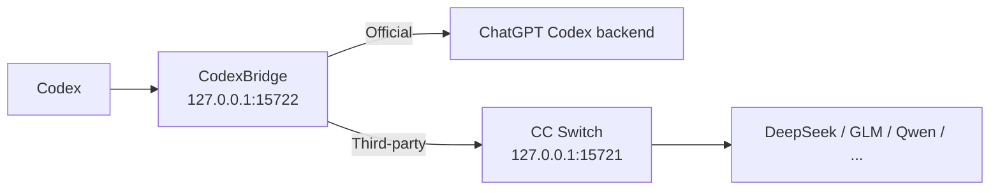

<div align="center">

# CodexBridge

**切 Provider，不切会话。**  
在 Codex 里从 **OpenAI Official** 切到 **DeepSeek / GLM / Qwen**，再切回来，尽可能继续同一条对话。

[下载最新版](../../releases) · [English](README.en.md) · [工作原理](docs/ARCHITECTURE.md) · [兼容性](docs/COMPATIBILITY.md)

[](../../actions/workflows/build-windows-release.yml)
[](../../actions/workflows/build-macos-release.yml)
[](../../releases)
[](LICENSE)
[](#支持范围)

</div>

> CodexBridge 是 **CC Switch 的非官方 companion**，不是 OpenAI 或 CC Switch 的官方组件。

## 30 秒理解

如果你正在用 **Codex + CC Switch**，可能遇到过：切 Provider 后旧对话还能看到，但继续发送会报错；tool / reasoning 历史在另一个 Provider 上不兼容；切回 Official 还残留三方状态。

CodexBridge 就是夹在 Codex 和不同 Provider 之间的兼容层：

```text
OpenAI Official
      ↓
DeepSeek
      ↓
GLM
      ↓
Qwen
      ↓
OpenAI Official

✅ 尽可能继续同一条 Codex 对话
```

它不是模型聚合器，也不替代 CC Switch；它补的是 **Official 账号态 ↔ API Provider 态之间的会话连续性**。

## 快速开始

### 最省事：下载 ZIP

如果你只是想用，不需要克隆仓库，也不需要手动配置 Python。

**方式 A：直接下载仓库 ZIP**

```text
Code → Download ZIP → 解压
```

然后双击：

```text
Windows → Start CodexBridge.cmd
macOS   → Start CodexBridge.command
```

**方式 B：Windows 10/11：推荐 Release ZIP**

从 [Releases](../../releases) 下载：

```text
CodexBridge-Windows.zip
```

解压后双击：

```text
Start CodexBridge.cmd
```

首次运行会自动准备用户级 runtime 并完成初始化；**不需要管理员权限，也不需要手动安装 Python**。

> Windows 正式 Release **不再分发预编译 `CodexBridge-Setup.exe`**。不要为了运行 CodexBridge 关闭 Defender、关闭实时保护或给整个目录加白名单。

**方式 C：macOS：Release ZIP**

从 [Releases](../../releases) 下载与你的 Mac 对应的包：

```text
Apple Silicon → CodexBridge-macOS-AppleSilicon-unsigned.zip
Intel         → CodexBridge-macOS-Intel-unsigned.zip
```

解压后双击：

```text
Start CodexBridge.command
```

macOS 当前为 **Beta**。Release 暂未做 Apple Developer 签名/公证，因此文件名带 `-unsigned`。

首次启动如果被 Gatekeeper 提醒，在 Finder 中对 `Start CodexBridge.command` **右键 → 打开** 一次即可；不要关闭 Gatekeeper。

## 日常使用（Windows）

CodexBridge 启动后会常驻 Windows 系统托盘。右键托盘图标可以：

- **Status: ...**：查看当前运行状态。
- **Restart Codex**：手动重启 Codex。
- **Restart CC Switch**：手动重启 CC Switch。
- **Ensure Bridge Running**：检查并恢复 Bridge。
- **Pause automatic restarts**：临时暂停自动重启处理。
- **Start CodexBridge with Windows**：开关 Windows 登录自启动。
- **Open Installed App Folder / Open ... Log / Open Log Folder**：打开安装目录或日志。
- **Exit Everything...**：关闭 CodexBridge、Bridge 和 CC Switch；不会卸载，也不会改写 `config.toml` 或重启 Codex。轻量 watcher 会继续保留，之后重新打开 CC Switch 时 CodexBridge 会自动启动。
- **Uninstall CodexBridge...**：彻底卸载 CodexBridge。

双击托盘图标会直接打开日志目录。

## 卸载（Windows）

推荐直接使用：

```text
托盘图标 → Uninstall CodexBridge...
```

也可以在仓库或 Release 包中双击：

```text
Uninstall CodexBridge.cmd
```

卸载会关闭 Bridge 和 CC Switch，删除 CodexBridge 的本地程序、runtime、日志、自启动项和 watcher，并优先恢复安装前的 Codex 配置；如果没有完整的安装前配置快照，则回退到直接 Official 路由。

**不会删除你的 Codex 聊天记录。**

## 它能做什么？

- **继续同一条会话**：Official ↔ DeepSeek / GLM / Qwen 切换时，尽量保持原 Codex 对话可继续。
- **兼容 tool / reasoning 历史**：跨 Provider 状态不兼容时，自动走安全 fallback，而不是直接把会话炸掉。
- **自动处理切换**：CC Switch 切 Provider 后，自动处理 Bridge 路由、模型列表和必要的 Codex / CC Switch 重启。
- **不改写聊天历史**：不直接修改 `.codex/sessions`、Codex SQLite 历史或 `.codex/auth.json`。
- **一次启动，后台接管**：正常使用时不需要手动改 `config.toml`、手动启动 Bridge 或盯着 CC Switch。

### Before / After

| 场景 | 没有 CodexBridge | 使用 CodexBridge |
| --- | --- | --- |
| Official → DeepSeek | 旧会话可能继续失败 | 自动兼容 / fallback |
| DeepSeek → GLM | tool / reasoning state 可能冲突 | 保守转换后继续 |
| 再切回 Official | 可能残留三方状态 | 回到 Official 路由 |
| 日常操作 | 可能手改配置 / 重启 | 尽量自动处理 |

如果 CodexBridge 正好解决了你的工作流，**⭐ Star** 可以帮助更多遇到同样问题的人发现它。

## 支持范围

| 路线 / 平台 | 状态 |
| --- | --- |
| Windows 10/11 x64 | ✅ 主路径 |
| macOS Apple Silicon / Intel | 🧪 Beta / CI 验证 |
| OpenAI Official | ✅ 已回归 |
| GLM | ✅ 已回归 |
| DeepSeek | ✅ 已回归 |
| Qwen | ✅ 已回归 |
| MiniMax / Claude / Gemini 等 | 🟡 Best effort，取决于 CC Switch / 上游是否提供 Codex 所需的 Responses 语义 |
| Linux / WSL | 🧪 开发路径 |

> “已回归”表示当前测试组合通过，不代表未来任意 Codex、CC Switch 或 Provider 版本都不会变化。

## 工作原理



CodexBridge 保持稳定的 `custom` provider 身份。**Codex 当前可见的对话历史是共同事实，但每个 Provider 的隐藏状态彼此隔离**：Official 优先使用受保护的 resident WebSocket continuation；第三方只在 checkpoint 能证明安全时复用 provider-local cursor。只要跨 Provider（包括 DeepSeek → GLM 这种三方之间切换），不能共享的 response id / reasoning / tool state 都必须经过 portable replay 边界。

如果 continuation 不能证明安全，就发送完整 portable replay；如果目标上游明确返回典型的跨 Provider structured-state 400/422，compatibility firewall 才会做一次更保守的 stateless retry。它不会为了“兼容”去伪造 tool output，也不会把普通鉴权、额度、模型不存在等错误伪装成历史格式问题。

完整设计见 [docs/ARCHITECTURE.md](docs/ARCHITECTURE.md)；已验证与 Best-effort Provider 边界见 [docs/COMPATIBILITY.md](docs/COMPATIBILITY.md)。

## 常见问题

<details>
<summary><strong>它会修改或删除我的 Codex 历史吗？</strong></summary>

不会直接改写 `.codex/sessions`、Codex SQLite 历史或 `.codex/auth.json`。它会修改用户级 Codex 路由配置，并在需要时保留配置备份。

</details>

<details>
<summary><strong>需要一直开着 CC Switch 吗？</strong></summary>

Official 路由不依赖 CC Switch；第三方路由依赖 CC Switch 的本地代理。如果三方路由仍在使用而代理消失，Launcher 会尝试恢复它。

</details>

<details>
<summary><strong>普通用户需要 Python 吗？</strong></summary>

不需要手动安装。首次运行会自动准备用户级 runtime。

</details>

<details>
<summary><strong>为什么不能保证“任何模型 100% 都能切”？</strong></summary>

不同 Provider 对 Responses、tool call、reasoning、streaming 和 continuation state 的实现并不完全一致。CodexBridge 的兼容逻辑尽量按“能力和状态安全”判断，而不是给 DeepSeek / GLM / Qwen 分别写死一套分支：能安全 continuation 就继续，不能就 full replay，仍不支持时明确失败而不是污染原会话。

目前 Official / GLM / DeepSeek / Qwen 是回归验证路径；其他 Provider 为 Best effort。详见 [兼容性说明](docs/COMPATIBILITY.md)。

</details>

<details>
<summary><strong>为什么还要发布 GitHub Release，直接下载源码 ZIP 不行吗？</strong></summary>

源码 ZIP 更像“仓库快照”；Release 把一个经过 CI 验证的 tag、平台包、SHA-256 和变更记录绑定在一起，让普通用户能下载明确的 Windows / macOS 产物，也让项目出现问题时可以准确定位和回滚到某个版本。

项目的公开版本以根目录 [`VERSION`](VERSION) 为准；版本规则见 [docs/VERSIONING.md](docs/VERSIONING.md)。

</details>

## 排障

Windows 日志默认在：

```text
%LOCALAPPDATA%\CodexProviderBridge\launcher.log
%LOCALAPPDATA%\CodexProviderBridge\bridge-stdout.log
%LOCALAPPDATA%\CodexProviderBridge\bridge-stderr.log
```

提交 Issue 时，建议附上：Codex 版本、CC Switch 版本、Provider / 模型、切换顺序（例如 `Official → DeepSeek → Official`）和相关时间段日志。请先删除你不希望公开的个人信息。

## 安全与隐私

- Bridge 默认只监听 `127.0.0.1`；不要暴露到公网。
- 不要在 Issue 中粘贴 token、API key 或未脱敏日志。
- Windows Release ZIP 不要求关闭 Defender 或添加安全白名单。
- SHA-256 用于校验下载完整性，不等于安全认证。
- 安全问题请按 [SECURITY.md](SECURITY.md) 报告。

## 开发与贡献

- 架构说明：[docs/ARCHITECTURE.md](docs/ARCHITECTURE.md)
- 兼容性矩阵：[docs/COMPATIBILITY.md](docs/COMPATIBILITY.md)
- 项目讲解 / 面试版：[docs/PROJECT_OVERVIEW.zh-CN.md](docs/PROJECT_OVERVIEW.zh-CN.md)
- 版本规则：[docs/VERSIONING.md](docs/VERSIONING.md)
- 变更记录：[CHANGELOG.md](CHANGELOG.md)
- 贡献指南：[CONTRIBUTING.md](CONTRIBUTING.md)
- 安全策略：[SECURITY.md](SECURITY.md)

Bug report、兼容性测试和 PR 都欢迎。

## 致谢

- [CC Switch](https://github.com/farion1231/cc-switch) 提供多 Provider 管理与本地路由能力；
- OpenAI Codex / Responses 生态提供本项目适配的客户端与会话模型。

CodexBridge 与 OpenAI、CC Switch 项目及其作者均无官方隶属关系。

## License

[MIT](LICENSE)

---

<div align="center">

**如果 CodexBridge 对你有用，欢迎点一个 ⭐ Star。**

</div>
